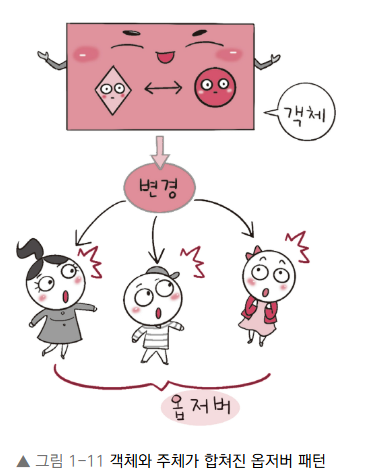

# 1. 디자인 패턴과 프로그래밍 패러다임
라이브러리 : 공통으로 사용될 수 있는 특정한 기능들을 모듈화한 것을 의미한다. 폴더명, 파일명 등에 대한 규칙이 없고 프레임워크에 비해 자유롭다. 예를 들어 무언가를 자를 때 '도구'인 '가위'를 사용해서 '내가' 직접 컨트롤하여 자르는데, 라이브러리는 이와 비슷하다. 

프레임워크 : 공통으로 사용될 수 있는 특정한 기능들을 모듈화한 것을 의미한다. 폴더명, 파일명 등에 대한 규칙이 있으며 라이브러리에 비해 좀 더 엄격하다. 다른 곳으로 이동할 때 '도구'인 비행기를 타고 이동하지만 '비행기'가 컨트롤하고 나는 가만히 앉아있어야 한다. 프레임워크는 이와 비슷하다. 

## 1-1. 디자인 패턴
디자인 패턴 : 프로그램을 설계할 때 발생했던 문제점들을 객체 간의 상호 관계 등을 이용하여 해결할 수 있도록 하나의 '규약' 형태로 만들어 놓은 것을 의미한다. 

자바스크립트 테스트 링크 : https://playcode.io/new/

자바 테스트 링크 : https://www.tutorialspoint.com/compilers/online-java-compiler.htm

### 1-1-1. 싱글톤 패턴
싱글톤 패턴(singleton pattern) : 하나의 클래스에 오직 하나의 인스턴스만 가지는 패턴이다. 보통 데이터베이스 연결 모듈에 많이 사용한다.
- 하나의 인스턴스를 만들어 놓고 해당 인스턴스를 다른 모듈들이 공유하며 사용하기 때문에 인스턴스를 생성할 때 드는 비용이 줄어드는 장점이 있다. 하지만 의존성이 높아진다는 단점이 있다. 

#### 자바스크립트의 싱글톤 패턴
- 자바스트립트에서 리터럴 {} 또는 new Object로 객체를 생성하게 되면 다른 어떤 객체와도 같지 않기 때문에 이 자체만으로 싱글톤 패턴을 구현할 수 있다. 
    <pre><code>
    const obj = {
        a: 27
    }
    const obj2 = {
        a: 27
    }
    console.log(obj===obj2)
    // false
    </code></pre>
    - obj와 obj2는 다른 인스턴스를 가진다. 이 또한 new Object 클래스에서 나온 단 하나의 인스턴스니 어느 정도 싱글톤 패턴이라 볼 수 있지만, 실제 싱글톤 패턴은 보통 다음과 같은 코드로 구성된다. 
    <pre><code>
    class Singleton{
        constructor(){
            if(!Singletone.instance){
                Singleton.instance = this
            }
            return Singleton.instance
        }

        getInstance(){
            return this
        }
    }
    const a = new Singleton()
    const b = new Singleton()
    console.log(a===b) // true
    </code></pre>
    - Singleton.instance 라는 하나의 인스턴스를 가지는 Singleton 클래스를 구현한 모습이다. 이를 톻애 a와 b는 하나의 인스턴스를 가진다. 

#### 데이터베이스 연결 모듈
<pre><code>
const URL = 'mongodb://localhost:27017/kundolapp'
const createConnection = url => ({"url":url})
class DB{
    constructor(url){
        if(!DB.instance){
            DB.instance = createConnection(url)
        }
        return DB.instance
    }

    connect(){
        return this.instance
    }
}
const a = new DB(URL)
const b = new DB(URL)
console.log(a===b) // true
</code></pre>
- DB.instance 라는 하나의 인스턴스를 기반으로 a,b를 생성하는 것을 볼 수 있다. 이를 통해 데이터베이스 연결에 관한 인스턴스 생성 비용을 아낄 수 있다.

#### 자바에서의 싱글톤 패턴
- 자바로는 중첩 클래스를 이용해서 만드는 방법이 가장 대중적이다. 
<pre><code>
class Singleton{
    private static class singleInstanceHolder {
        private static final Singleton INSTANCE = new Singleton();
    }
    public static Singleton getInstance(){
        return singleInstanceHolder.INSTANCE;
    }
}

public class HelloWorld{
    public static void main(String[] arg){
        Singleton a = Singleton.getInstance();
        Singleton b = Singleton.getInstance();
        System.out.println(a.hashCode());
        System.out.println(b.hashCode());
        if (a==b){
            System.out.println(true);
        }
        
    }
}
705927765
705927765
true
</code></pre>

#### mongoose의 싱글톤 패턴
- 실제로 싱글톤 패턴은 Node.js에서 MongoDB 데이터베이스를 연결할 때 쓰는 mongoose 모듈에서 볼 수 있다.

- mongoose의 데이터베이스를 연결할 때 쓰는 connect()라는 함수는 싱글톤 인스턴스를 반환한다.

<pre><code>
Mongoose.prototype.connect = function(uri,options,callback){
    const_mongoose = this instaceof Mongoose ? this : mongoose;
    const conn = _mongoose.connection;

    return _mongoose._promiseOrCallback(callback, cb=>{
        conn.openUri(uri, options,err=>{
            if(err!=null){
                return cb(err);
            }
            return cb(null,_mongoose);
        });
    });
};
</code></pre>

#### MySQL의 싱글톤 패턴
- Node.js에서 MySQL 데이터베이스를 연결할 때도 싱글톤 패턴이 쓰인다.

<pre><code>
const mysql = require('mysql');
const pool = mysql.createPool({
    connectionLimit : 10,
    host : 'example.org',
    user : 'kundol',
    password :'secret',
    database:'승철이디비'
});

// 모듈 A
pool.query(query, function(error, results,fields){
    if (error) throw error;
    console.log('The solution is: ',results[0].solution);
});

// 모듈 B
pool.query(query, function(error, results,fields){
    if (error) throw error;
    console.log('The solution is: ',results[0].solution);
});
</code></pre>
- 메인 모듈에서 데이터베이스 연결에 관한 인스턴스를 정의하고 다른 모듈인 A 또는 B에서 해당 인스턴스를 기반으로 쿼리를 보내는 형식으로 쓰인다. 

#### 싱글톤 패턴의 단점
- 싱글톤 패턴은 TDD(Test Driven Development)할 때 걸림돌이 된다. TDD할 때 단위 테스트를 주로 하는데, 단위 테스트는 테스트가 서로 독립적이어야 하며 테스트를 어떤 순서로든 실행할 수 있어야 한다. 

- 하지만 싱글톤 패턴은 미리 생성된 하나의 인스턴스를 기반으로 구현하는 패턴이므로 각 테스트마다 '독립적인' 인스턴스를 만들기가 어렵다. 

#### 의존성 주입
- 싱글톤 패턴은 사용하기가 쉽고 굉장히 실용적이지만 모듈 간의 결합을 강하게 만들 수 있다는 단점이 있다. 

- 의존성 주입(DI, Dependency Injection)을 통해 모듈 간의 결합을 조금 더 느슨하게 만들어 해결할 수 있다. 
- 의존성이란 종속성이라고도 하며 A가 B에 의존성이 있다는 것은 B의 변경 사항에 대해 A 또한 변해야 된다는 것을 의미한다. 

- 앞의 그림처럼 메인 모듈(main module)이 '직접' 다른 하위 모듈에 대한 의존성을 주기보다는 중간에 의존성 주입자(dependency injector)가 이 부분을 가로채 메인 모듈이 '간접'적으로 의존성을 주입하는 방식이다. 이를 통해 메인 모듈(상위 모듈)은 하위 모듈에 대한 의존성이 떨어지게 된다. 이를 '디커플링이 된다'고도 한다. 
    - 의존성 주입의 장점 : 모듈들을 쉽게 교체할 수 잇는 구조가 되어 테스팅하기 쉽고 마이그레이션하기도 수월하다. 또한 구현할 때 추상화 레이어를 넣고 이를 기반으로 구현체를 넣어주기 때문에 애플리케이션 의존성 방향이 일관되고, 애플리케이션을 쉽게 추론할 수 있으며, 모듈 간의 관계들이 조금 더 명확해진다. 
    - 의존성 주입의 단점 : 모듈들이 더욱더 분리되므로 클래스 수가 늘어나 복잡성이 증가될 수 있으며 약간의 런타임 패널티가 생기기도 한다. 
    - 의존성 주입 원칙 : 상위 모듈은 하위 모듈에서 어떠한 것도 가져오지 않아야 한다. 또한 둘 다 추상화에 의존해야 하며, 이때 추상화는 세부 사항에 의존하지 말아야 한다. 

### 1-1-2. 팩토리 패턴
팩토리 패턴(factory pattern) : 객체를 사용하는 코드에서 객체 생성 부분을 떼어내 추상화한 패턴이자 상속 관계에 있는 두 클래스에서 상위 클래스가 중요한 뼈대를 결정하고, 하위 클래스에서 객체 생성에 관한 구체적인 내용을 결정하는 패턴이다.
- 상위 클래스와 하위 클래스가 분리되기 떄문에 느슨한 결합을 가지며 상위 클래스에서는 인스턴스 생성 방식에 대해 전혀 알 필요가 없기 때문에 더 많은 유연성을 갖게 된다. 그리고 객체 생성 로직이 따로 떼어져 있기 때문에 코드를 리팩터링하더라도 한 곳만 고칠 수 있게 되니 유지 보수성이 증가된다. 
- 예를 들어 라떼 레시피와 아메리카노 레시피, 우유 레시피라는 구체적인 내용이 들어있는 하위 클래스가 컨베이어 벨트를 통해 전달되고, 상위 클래스인 바리스타 공장에서 이 레시피들을 토대로 우유 등을 생산하는 생산 공정을 생각하면 된다. 

#### 자바스트립트의 팩토리 패턴
- 간단하게 new Object()로 구현할 수 있다. 
<pre><code>
const num = new Object(42)
const str = new Object('abc')
new.constructor.name; // Number
str.constructor.name; // String
</code></pre>
- 숫자를 전달하거나 문자열을 전달함에 따라 다른 타입의 객체를 생성하는 것을 볼 수 있다. 즉, 전달받은 값에 따라 다른 객체를 생성하며 인스턴스의 타입 등을 정한다. 

- 커피 팩토리를 기반으로 라떼 등을 생산하는 코드를 구축하면 다음과 같다.
    <pre><code>
    class CoffeeFactory {
        static createCoffee(type) {
            const factory = factoryList[type]
            return factory.createCoffee()
        }
    }   
    class Latte {
        constructor() {
            this.name = "latte"
        }
    }
    class Espresso {
        constructor() {
            this.name = "Espresso"
        }
    } 

    class LatteFactory extends CoffeeFactory{
        static createCoffee() {
            return new Latte()
        }
    }
    class EspressoFactory extends CoffeeFactory{
        static createCoffee() {
            return new Espresso()
        }
    }
    const factoryList = { LatteFactory, EspressoFactory } 
    
    
    const main = () => {
        // 라떼 커피를 주문한다.  
        const coffee = CoffeeFactory.createCoffee("LatteFactory")  
        // 커피 이름을 부른다.  
        console.log(coffee.name) // latte
    }
    main()
    </code></pre>
- CoffeeFactory 라는 상위 클래스가 중요한 뼈대를 결정하고 하위 클래스인 LatteFactory가 구체적인 내용을 결정한다. => 의존성 주입이라고도 볼 수 있다.
    - CoffeeFactory에서 LatteFactory의 인스턴스를 생성하는 것이 아닌 LatteFactory에서 생성한 인스턴스를 CoffeeFactory에 주입하고 있기 때문이다. 
- CoffeeFactory 클래스를 보면 static 키워드를 통해 createCoffee() 메서드를 정적 메서드로 선언한 것을 볼 수 있는데, 이렇게 정적 메서드로 정의하면 클래스를 기반으로 객체를 만들지 않고 호출이 가능하며, 해당 매서드에 대한 메모리 할당을 한 번만 할 수 있는 장점이 있다. 

#### 자바의 팩토리 패턴
- 이를 자바로 구현하면 다음과 같다. 
<pre><code>
enum CoffeeType {
    LATTE,
    ESPRESSO
}

abstract class Coffee {
    protected String name;

    public String getName() {
        return name;
    }
}

class Latte extends Coffee {
    public Latte() {
        name = "latte";
    }
}

class Espresso extends Coffee {
    public Espresso() {
        name = "Espresso";
    }
}

class CoffeeFactory {
    public static Coffee createCoffee(CoffeeType type) {
        switch (type) {
            case LATTE:
                return new Latte();
            case ESPRESSO:
                return new Espresso();
            default:
                throw new IllegalArgumentException("Invalid coffee type: " + type);
        }
    }
}

public class Main {
    public static void main(String[] args) { 
        Coffee coffee = CoffeeFactory.createCoffee(CoffeeType.LATTE); 
        System.out.println(coffee.getName()); // latte
    }
}
</code></pre>
- 앞의 코드는 CoffeeFactory 밑에 Coffee 클래스를 놓고 해당 클래스를 상속하는 Latte, Espresso 클래스를 기반으로 구현한 모습이다. 

- Enum : 상수의 집합을 정의할 때 사용되는 타입이다. 예를 들어 월, 일, 색상 등의 상수 값을 담는다. 자바에서는 Enum이 다른 언어보다 더 활발히 활용되며, 상수뿐만 아니라 메서드를 집어넣어 관리할 수도 있다. Enum을 기반으로 상수 집합을 관리한다면 코드를 리팩터링할 때 상수 집합에 대한 로직 수정 시 이 부분만 수정하면 된다는 장점이 있고, 본질적으로 스레드세이프(thread safe)하기 때문에 싱글톤 패턴을 만들 때 도움이 된다.
    - '큰돌의 터전' - JAVA로 싱글톤 패턴을 구현하는 7가지 방법 영상 참고

### 1-1-3. 전략 패턴
전략 패턴(strategy pattern) : 정책 패턴(policy pattern)이라고도 하며, 객체의 행위를 바꾸고 싶은 경우 '직접' 수정하지 않고 전략이라고 부르는 '캡슐화한 알고리즘'을 컨텍스트 안에서 바꿔주면서 상호 교체가 가능하게 만드는 패턴이다. 

- 컨텍스트 : 프로그래밍에서의 컨텍스트는 상황, 맥략, 문맥을 의미하며 개발자가 어떠한 작업을 완료하는 데 필요한 모든 관련 정보를 말한다. 

우리가 어떤 것을 살 때 네이버 페이, 카카오 페이 등 다양한 방법으로 결제하듯이 어떤 아이템을 살 때 LUNACard로 사는 것과 KAKAOCard로 사는 것을 구현한 예제이다. 결제 방식의 '전략'만 바꿔서 두 가지 방식으로 결제하는 것을 구현했다.
#### 자바의 전략 패턴
<pre><code>
import java.text.DecimalFormat;
import java.util.ArrayList;
import java.util.List;
interface PaymentStrategy { 
    public void pay(int amount);
} 

class KAKAOCardStrategy implements PaymentStrategy {
    private String name;
    private String cardNumber;
    private String cvv;
    private String dateOfExpiry;
    
    public KAKAOCardStrategy(String nm, String ccNum, String cvv, String expiryDate){
        this.name=nm;
        this.cardNumber=ccNum;
        this.cvv=cvv;
        this.dateOfExpiry=expiryDate;
    }

    @Override
    public void pay(int amount) {
        System.out.println(amount +" paid using KAKAOCard.");
    }
} 

class LUNACardStrategy implements PaymentStrategy {
    private String emailId;
    private String password;
    
    public LUNACardStrategy(String email, String pwd){
        this.emailId=email;
        this.password=pwd;
    }
    
    @Override
    public void pay(int amount) {
        System.out.println(amount + " paid using LUNACard.");
    }
} 

class Item { 
    private String name;
    private int price; 
    public Item(String name, int cost){
        this.name=name;
        this.price=cost;
    }

    public String getName() {
        return name;
    }

    public int getPrice() {
        return price;
    }
} 

class ShoppingCart { 
    List<Item> items;
    
    public ShoppingCart(){
        this.items=new ArrayList<Item>();
    }
    
    public void addItem(Item item){
        this.items.add(item);
    }
    
    public void removeItem(Item item){
        this.items.remove(item);
    }
    
    public int calculateTotal(){
        int sum = 0;
        for(Item item : items){
            sum += item.getPrice();
        }
        return sum;
    }
    
    public void pay(PaymentStrategy paymentMethod){
        int amount = calculateTotal();
        paymentMethod.pay(amount);
    }
}  

public class HelloWorld{
    public static void main(String []args){
        ShoppingCart cart = new ShoppingCart();
        
        Item A = new Item("kundolA",100);
        Item B = new Item("kundolB",300);
        
        cart.addItem(A);
        cart.addItem(B);
        
        // pay by LUNACard
        cart.pay(new LUNACardStrategy("kundol@example.com", "pukubababo"));
        // pay by KAKAOBank
        cart.pay(new KAKAOCardStrategy("Ju hongchul", "123456789", "123", "12/01"));
    }
}
/*
400 paid using LUNACard.
400 paid using KAKAOCard.
*/
</code></pre>
- 앞의 코드는 쇼핑 카트에 아이템을 담아 LUNACard 또는 KAKAOCard라는 두 개의 전략으로 결제하는 코드이다. 

#### passport의 전략 패턴
- 전략 패턴을 활용한 라이브러리로는 passport가 있다. 
- passport : Node.js에서 인증 모듈을 구현할 때 쓰는 미들웨어 라이브러리로, 여러 가지 '전략'을 기반으로 인증할 수 있게 한다. 서비스 내의 회원가입된 아이디와 비밀번호를 기반으로 인증하는 LocalStrategy 전략과 페이스북, 네이버 등 다른 서비스를 기반으로 인증하는 OAuth 전략 등을 지원한다. 

- 다음 코드처럼 '전략'만 바꿔서 인증하는 것을 볼 수 있다.
    <pre><code>
    var passport = require('passport')
        , LocalStrategy = require('passport-local').Strategy;

    passport.use(new LocalStrategy(
        function(username, password, done) {
            User.findOne({ username: username }, function (err, user) {
            if (err) { return done(err); }
                if (!user) {
                    return done(null, false, { message: 'Incorrect username.' });
                }
                if (!user.validPassword(password)) {
                    return done(null, false, { message: 'Incorrect password.' });
                }
                return done(null, user);
            });
        }
    ));
    </code></pre>
    - passport.use(new LocalStrategy( ...처럼 passport.use()라는 메서드에 '전략'을 매개변수로 넣어서 로직을 수행하는 것을 볼 수 있다.

### 1-1-4. 옵저버 패턴
- 옵저버 패턴(observer pattern) : 주체가 어떤 객체(subject)의 상태 변화를 관찰하다가 상태 변화가 있을 때마다 메서드 등을 통해 옵저버 목록에 있는 옵저버들에게 변화를 알려주는 디자인 패턴이다. 

- 주체란 객체의 상태 변화를 보고 있는 관찰자이며, 옵저버들이란 이 객체의 상태 변화에 따라 전달되는 메서드 등을 기반으로 '추가 변화 사항'이 생기는 객체들을 의미한다. 

- 또한, 앞의 그림처럼 주체와 객체를 따로 두지 않고 상태가 변경되는 객체를 기반으로 구축하기도 한다. 

- 옵저버 패턴을 활용한 서비스로는 트위터가 있다.

- 앞의 그림처럼 내가 어떤 사람인 주체를 '팔로우'했다면 주체가 포스팅을 올리게 되면 알림이 '팔로워'에게 가야한다. 

또한, 옵저버 패턴은 주로 이벤트 기반 시스템에 사용하며 MVC(Model-View-Controller) 패턴에도 사용된다.
- 예를 들어 주체라고 볼 수 있는 모델(model)에서 변경 사항이 생겨 update() 메서드로 옵저버인 뷰에 알려주고 이를 기반으로 컨트롤러(controller) 등이 작동하는 것이다. 

#### 자바에서의 옵저버 패턴    
<pre><code>
import java.util.ArrayList;
import java.util.List;

interface Subject {
    public void register(Observer obj);
    public void unregister(Observer obj);
    public void notifyObservers();
    public Object getUpdate(Observer obj);
}

interface Observer {
    public void update(); 
}

class Topic implements Subject {
    private List<Observer> observers;
    private String message; 

    public Topic() {
        this.observers = new ArrayList<>();
        this.message = "";
    }

    @Override
    public void register(Observer obj) {
        if (!observers.contains(obj)) observers.add(obj); 
    }

    @Override
    public void unregister(Observer obj) {
        observers.remove(obj); 
    }

    @Override
    public void notifyObservers() {   
        this.observers.forEach(Observer::update); 
    }

    @Override
    public Object getUpdate(Observer obj) {
        return this.message;
    } 
    
    public void postMessage(String msg) {
        System.out.println("Message sended to Topic: " + msg);
        this.message = msg; 
        notifyObservers();
    }
}

class TopicSubscriber implements Observer {
    private String name;
    private Subject topic;

    public TopicSubscriber(String name, Subject topic) {
        this.name = name;
        this.topic = topic;
    }

    @Override
    public void update() {
        String msg = (String) topic.getUpdate(this); 
        System.out.println(name + ":: got message >> " + msg); 
    } 
}

public class HelloWorld { 
    public static void main(String[] args) {
        Topic topic = new Topic(); 
        Observer a = new TopicSubscriber("a", topic);
        Observer b = new TopicSubscriber("b", topic);
        Observer c = new TopicSubscriber("c", topic);
        topic.register(a);
        topic.register(b);
        topic.register(c); 
   
        topic.postMessage("amumu is op champion!!"); 
    }
}
/*
Message sended to Topic: amumu is op champion!!
a:: got message >> amumu is op champion!!
b:: got message >> amumu is op champion!!
c:: got message >> amumu is op champion!!
*/ 
</code></pre>
- topic을 기반으로 옵저버 패턴을 구현했다. 여기서 topic은 주체이자 객체가 된다. class Topic implement Subject를 통해 Subject interface를 구현했고 Observer a = new TopicSubscriber("a", topic);으로 옵저버를 선언할 때 해당 이름과 어떠한 토픽의 옵저버가 될 것인지를 정했다. 

##### 자바 : 상속과 구현
- **상속** : 상속(extends)은 자식 클래스가 부모 클래스의 메서드 등을 상속받아 사용하며 자식 클래스에서 추가 및 확장을 할 수 있는 것을 말한다. 이로 인해 재사용성, 중복성의 최소화가 이루어진다.
- **구현** : 구현(Implements)은 부모 인터페이스(interface)를 자식 클래스에서 재정의하여 구현하는 것을 말하며, 상속과는 달리 반드시 부모 클래스의 메서드를 재정의하여 구현해야 한다. 
- **상속과 구현의 차이** : 상속은 일반 클래스, abstract 클래스를 기반으로 구현하며, 구현은 인터페이스를 기반으로 구현한다. 

#### 자바스크립트에서의 옵저버 패턴
- 자바스크립트에서의 옵저버 패턴은 프록시 객체를 통해 구현할 수도 있다. 

##### 프록시 객체
프록시(proxy) 객체 : 어떠한 대상의 기본적인 동작(속성 접근, 할당, 순회, 열거, 함수 호출 등)의 작업을 가로챌 수 있는 객체를 뜻하며, 자바스크립트에서 프록시 객체는 두 개의 매개변수를 가진다. 
    - target : 프록시할 대상
    - handler : target 동작을 가로채고 어떠한 동작을 할 것인지가 설정되어 있는 함수

다음은 프록시 객체를 구현한 코드이다.
<pre><code>
const handler = {
    get: function(target, name){
        return name == 'name' ? '${target.a} ${target.b}' : target[name]
    }
}
const p = new Proxy({a : 'KUNDOL',b:'IS AUMUMU ZANGIN'},handler)
console.log(p.name) // KUNDOL IS AUMUMU ZANGIN
</code></pre>
new Proxy()로 a와 b 속성을 가지고 있는 객체와 handler 함술르 매개변수로 넣고 p라는 변수를 선언했다. 이후 p의 name 속성을 참조하니 a와 b라는 속성밖에 없는 객체가 handler의 "name이라는 속성에 접근ㄴ할 때 a와 b를 합쳐서 문자열을 만들라"는 로직에 따라 어떤 문자열을 만든다. 이렇게 name 속성 등 특정 속성에 접근할 때 그 부분을 가로채서 어떠한 로직을 강제할 수 있는 것이 프록시 객체이다. 

##### 프록시 객체를 이용한 옵저버 패턴
자바스크립트의 프록시 객체를 통해 옵저버 패턴을 구현한 코드는 다음과 같다.
<pre><code>
function createReactiveObject(target, callback) { 
    const proxy = new Proxy(target, {
        set(obj, prop, value){
            if(value !== obj[prop]){
                const prev = obj[prop]
                obj[prop] = value 
                callback(`${prop}가 [${prev}] >> [${value}] 로 변경되었습니다`)
            }
            return true
        }
    })
    return proxy 
} 
const a = {
    "형규" : "솔로"
} 
const b = createReactiveObject(a, console.log)
b.형규 = "솔로"
b.형규 = "커플"
// 형규가 [솔로] >> [커플] 로 변경되었습니다
</code></pre>
- 프록시 객체의 get() 함수는 속성과 함수에 대한 접근을 가로채며, has() 함수는 in 연산자의 사용을 가로챈다. set() 함수는 속성에 대한 접근을 가로챈다. set() 함수를 통해 속성에 대한 접근을 "가로채"서 형규라는 속성이 솔로에서 커플로 되는 것을 감시할 수 있었다. 

#### Vue.js 3.0의 옵저버 패턴
- 프론트엔드에서 많이 쓰는 프레임워크 Vue.js 3.0에서 ref나 reactive로 정의하면 해당 값이 변경되었을 때 자동으로 DOM에 있는 값이 변경되는데, 이는 앞서 설명한 프록시 객체를 이용한 옵저버 패턴을 이용하여 구현한 것이다. 
    - DOM(Document Object Model) : 문서 객체 모델을 말하며, 웹 브라우저상의 화면을 이루고 있는 요소들을 지칭한다.

<pre><code>
function createReactiveObject(
    target : Target,
    isReadonly : boolean,
    baseHandlers : ProxyHandler<any>,
    collectionHandlers : ProxyHandler<any>m
    proxyMap : WeakMap<Target,any>
){
    if(!isObject(target)){
        if(__DEV__){
            console.warn('value cannot be made reactive: ${String(target)}')
        }
        return target
    }
    // target is already a Proxy, return it.
    //  exception : calling readonly() on a reactive object
    if(
        target[ReactiveFlags.RAW] && !(isReadonly && target[ReactiveFlags.IS_REACTIVE])
    ){
        return target
    }
    // target already has corresponding Proxy
    const existingProxy = proxyMap.get(target)
    if(existingProxy){
        return existingProxy
    }
    // only a whitelist of value types can be observed.
    const targetType = getTargetType(target)
    if(targetType == TargetType.INVALID){
        return target
    }
    const proxy = new Proxy(
        target,
        targetType === TargetType.COLLECTION ? collectionHandlers : baseHandlers
    )
    proxyMap.set(target, proxy)
    return proxy
}
</code></pre>
- 앞의 코드는 실제로 Vue.js 3.0의 옵저버 패턴이 담긴 코드이다. proxyMap이라는 프록시 객체를 사용했고, 객체 내부의 get(), set() 메서드를 사용한 것을 볼 수 있다. 

### 1-1-5. 프록시 패턴과 프록시 서버
앞서 설명한 프록시 객체는 사실 디자인 패턴 중 하나인 프록시 패턴이 녹아들어 있는 객체이다. 

#### 프록시 패턴
프록시 패턴(proxy pattern) : 대상 객체(subject)에 접근하기 전 그 접근에 대한 흐름을 가로채 해당 접근을 필터링하거나 수정하는 등의 역할을 하는 계층이 있는 디자인 패턴이다. 

이를 통해 객체의 속성, 변환 등을 보완하며 보안, 데이터 검증, 캐싱, 로깅에 사용한다. 이는 앞서 설명한 프록시 객체로 쓰이기도 하지만 프록시 서버로도 활용된다.
- 프록시 서버에서의 캐싱 : 캐시 안에 정보를 담아주고, 캐시 안에 있는 정보를 요구하는 요청에 대해 다시 저 멀리 있는 원격 서버에 요청하지 않고 캐시 안에 있는 데이터를 활용하는 것을 말한다. 이를 통해 불필요하게 외부와 연결하지 않기 때문에 트래픽을 줄일 수 있다는 장점이 있다. 

#### 프록시 서버
프록시 서버(proxy server) : 서버와 클라이언트 사이에서 클라이언트가 자신을 통해 다른 네트워크 서비스에 간접적으로 접속할 수 있게 해주는 컴퓨터 시스템이나 응용 프로그램을 가리킨다. 

##### 프록시 서버로 쓰는 nginx
nginx는 비동기 이벤트 기반의 구조와 다수의 연결을 효과적으로 처리 가능한 웹서버이며, 주로 Node.js 서버 앞단의 프록시 서버로 활용된다. 
<pre>"You just may be hacked when some yet-unknown buffer overflow is discovered. Not that couldn't happend behind nginx, but somehow having a proxy in front makes me happy."
"Node.js의 버퍼 오버플로우 취약점을 예방하기 위해서는 nginx를 프록시 서버로 앞단에 놓고 Node.js를 뒤쪽에 놓는 것이 좋다."
-Ryan Dahl(라이언달, Node.js 창시자)
</pre>
- 이를 통해 익명 사용자가 직접적으로 서버에 접근하는 것을 차단하고, 간접적으로 한 단계를 더 거치게 만들어서 보안을 강화할 수 있다.

- 앞의 그림처럼 nginx를 프록시 서버로 둬서 실제 포트를 숨길 수 있고 정적 자원을 gzip 압축하거나, 메인 서버 앞단에서의 로깅을 할 수도 있다.

- 버퍼 오버플로우 : 버퍼는 보통 데이터가 저장되는 메모리 공간으로, 메모리 공간을 벗어나는 경우를 말한다. 이때 사용되지 않아야 할 영역에 데이터가 덮어씌워져 주소, 값을 바꾸는 공격이 발생하기도 한다. 
- gzip 압축 : LZ77과 Huffman 코딩의 조합인 DEFLATE 알고리즘을 기반으로 한 압축 기술이다. gzip 압축을 하면 데이터 전송량을 줄일 수 있지만, 압축을 해제했을 때 서버에서의 CPU 오버헤드도 생각해서 gzip 압축 사용 유무를 결정해야 한다. 

##### 프록시 서버로 쓰는 CloudFlare
CloudFlare는 전 세계적으로 분산된 서버가 있고 이를 통해 어떠한 시스템의 콘텐츠 전달을 빠르게 할 수 있는 CDN 서비스이다. 

    - CDN(Content Delivery Network) : 각 사용자가 인터넷에 접속하는 곳과 가까운 곳에서 콘텐츠를 캐싱 또는 배포하는 서버 네트워크를 말한다. 이를 통해 사용자가 웹 서버로부터 콘텐츠를 다운로드하는 시간을 줄일 수 있다. 

- CloudFlare는 웹 서버 앞단에 프록시 서버로 두어 DDOS 공격 방어나 HTTPS 구축에 쓰인다. 
- 서비스를 배포한 이후에 해외에서 무언가 의심스러운 트래픽이 많이 발생하면 이 때문에 많은 클라우드 서비스 비용이 발생할 수도 있는데, 이때 CloudFlare가 의심스러운 트래픽인지를 먼저 판단해 CAPTCHA 등을 기반으로 이를 일정부분 막아주는 역할도 수행한다. 

앞의 그림처럼 사용자, 크롤러, 공격자가 자신의 웹 사이트를 접속하게 될 텐데, 이때 CloudFlare를 통해 공격자로부터 보호할 수 있다. 

- **DDOS 공격 방어** : DDOS는 짧은 기간 동안 네트워크에 많은 요청을 보내 네트워크를 마비시켜 웹 사이트의 가용성을 방해하는 사이버 공격 유형이다. CloudFlare는 의심스러운 트래픽, 특히 사용자가 접속하는 것이 아닌 시스템을 통해 오는 트래픽을 자동으로 차단해서 DDOS 공격으로부터 보호한다. CloudFlare의 거대한 네트워크 용량과 캐싱 전략으로 소규모 DDOS 공격은 쉽게 막아낼 수 있으며 이러한 공격에 대한 방화벽 대시보드도 제공한다. 
- **HTTPS 구축** : 서버에서 HTTPS를 구축할 때 인증서를 기반으로 구축할 수도 있다. 하지만 CloudFlare를 사용하면 별도의 인증서 설치 없이 좀 더 손쉽게 HTTPS를 구축할 수 있다. 

##### CORS와 프론트엔드의 프록시 서버
CORS(Cross-Origin Resource Sharing)는 서버가 웹 브라우저에서 리소스를 로드할 때 다른 오리진을 통해 로드하지 못하게 하는 HTTP 헤더 기반 메커니즘이다. 
    
    오리진 : 프로토콜과 호스트 이름, 포트의 조합을 말한다. 예를 들어 https://kunkol.com:12010/test라는 주소에서 오리진은 https://kunkol.com:12010을 뜻한다. 

- 프론트엔드 개발 시 프론트엔드 서버를 만들어서 백엔드 서버와 통신할 때 주로 CORS 에러를 마주치는데, 이를 해결하기 위해 프론트엔드에서 프록시 서버를 만들기도 한다. 
- 예를 들어 프론트엔드에서는 127.0.0.1:3000으로 테스팅을 하는데 백엔드 서버는 127.0.0.1:12010이라면 포트 번호가 다르기 때문에 CORS 에러가 나타난다. 이때 프록시 서버를 둬서 프론트엔드 서버에서 요청되는 오리진을 127.0.0.1:12010으로 바꾸는 것이다. 

<pre>참고) 127.0.1이란 루프백(loopback) IP로, 본인 PC 서버의 IP를 뜻한다. localhost나 127.0.0.1을 주소창에 입력하면 DNS를 거치지 않고 바로 본인 PC 서버로 연결된다.</pre> 

앞의 그림처럼 프론트엔드 서버 앞단에 프록시 서버를 놓아 /api 요청은 users API, /api2 요청은 users API2에 요청할 수 있다. CORS 에러 해결은 물론 다양한 API 서버와의 통신도 매끄럽게 할 수 있다. 
- 참고) '큰돌의 터전 - CORS' 영상

### 1-1-6. 이터레이터 패턴
이터레이터 패턴(iterator pattern) : 이터레이터(iterator)를 사용하여 컬렉션(collection)의 요소들에 접근하는 디자인 패턴이다. 이를 통해 순회할 수 있는 여러 가지 자료형의 구조와는 상관없이 이터레이터라는 하나의 인터페이스로 순회가 가능하다. 

#### 자바스크립트에서의 이터레이터 패턴
<pre><code>
const mp = new Map() 
mp.set('a', 1)
mp.set('b', 2)
mp.set('cccc', 3) 
const st = new Set() 
st.add(1)
st.add(2)
st.add(3) 
const a = []
for(let i = 0; i < 10; i++)a.push(i)

for(let aa of a) console.log(aa)
for(let a of mp) console.log(a)
for(let a of st) console.log(a) 
/* 
a, b, c 
[ 'a', 1 ]
[ 'b', 2 ]
[ 'c', 3 ]
1
2
3
*/
</code></pre>
분명히 다른 자료 구조인 set과 map임에도 똑같은 for a of b 라는 이터레이터 프로토콜을 통해 순회하는 것을 볼 수 있다. 

    이터레이터 프로토콜 : 이터러블한 객체들을 순회할 때 쓰이는 규칙
    
    이터러블한 객체 : 반복 가능한 객체로 배열을 일반화한 객체

### 1-1-7. 노출모듈 패턴
노출모듈 패턴(revealing module pattern) : 즉시 실행 함수를 통해 private, public 같은 접근 제어자를 만드는 패턴을 말한다. 자바스크립트는 private나 public같은 접근 제어자가 존재하지 않고 전역 범위에서 스크립트가 실행된다. 그렇기 때문에 노출모듈 패턴을 통해 private와 public 접근 제어자를 구현하기도 한다. 

<pre><code>
const pukuba = (() => {
    const a = 1
    const b = () => 2
    const public = {
        c : 2, 
        d : () => 3
    }
    return public 
})() 
console.log(pukuba)
console.log(pukuba.a)
// { c: 2, d: [Function: d] }
// undefined
</code></pre>
- a와 b는 다른 모듈에서 사용할 수 있는 변수나 함수인 private 범위를 가진다. 
- c와 d는 다른 모듈에서 사용할 수 있는 변수나 함수이며 public 범위를 가진다. 
- 앞서 설명한 노출모듈 패턴을 기반으로 만든 자바스크립트 모듈 방식으로는 CJS(CommonJS) 모듈 방식이 있다. 

<pre>
public : 클래스에 정의된 함수에서 접근 가능하며 자식 클래스와 외부 클래스에서 접근 가능한 범위
protected : 클래스에 정의된 함수에서 접근 가능, 자식 클래스에서 접근 가능하지만 외부 클래스에서 접근 불가능한 범위 
private : 클래스에 정의된 함수에서 접근 가능하지만 자식 클래스와 외부 클래스에서 접근 불가능한 범위
즉시 실행 함수 : 함수를 정의하자마자 바로 호출하는 함수. 초기화 코드, 라이브러리 내 전역 변수의 충돌 방지 등에 사용한다. 
</pre>

### 1-1-8. MVC 패턴
MVC 패턴 : 모델(model), 뷰(view), 컨트롤러(controller)로 이루어진 디자인 패턴

애플리케이션의 구성 요소를 세가지 역할로 구분하여 개발 프로세스에서 각각의 구성 요소에만 집중해서 개발할 수 있다. 재사용성과 확장성이 용이하다는 장점이 있고, 애플리케이션이 복잡해질수록 모델과 뷰의 관계가 복잡해지는 단점이 있다. 

- 모델
    - 모델은 애플리케이션의 데이터인 데이터베이스, 상수, 변수 등을 뜻한다.
    - 사각형 모양의 박스 안에 글자가 들어 있다면 그 사각형 모양의 박스 위치 정보, 글자 내용, 글자 위치, 글자 포맷(utf-8 등)에 관한 정보를 모두 가지고 있어야 한다. 
    - 뷰에서 데이터를 생성하거나 수정하면 컨트롤러를 통해 모델을 생성하거나 갱신한다.
- 뷰
    - 뷰는 inputbox, checkboux, textarea 등 사용자 인터페이스 요소를 나타낸다. 
    - 즉, 모델을 기반으로 사용자가 볼 수 있는 화면을 뜻한다. 모델이 가지고 있는 정보를 따로 저장하지 않아야 하며 단순히 사각형 모양 등 화면에 표시하는 정보만 가지고 있어야 한다. 또한 변경이 일어나면 컨트롤러에 이를 전달해야 한다. 
- 컨트롤러 
    - 컨트롤러는 하나 이상의 모델과 하나 이상의 뷰를 잇는 다리 역할을 하며 이벤트 등 메인 로직을 담당한다. 또한 모델과 뷰의 생명주기도 관리하며, 모델이나 뷰의 변경 통지를 받으면 이를 해석하여 각각의 구성 요소에 해당 내용에 대해 알려준다. 

#### MVC 패턴의 예 스프링
MVC 패턴을 이용한 대표적인 프레임워크로는 자바 플랫폼을 위한 오픈 소스 애플리케이션 프레임워크인 스프링(Spring)이 있다. 
- Spring의 WEB MVC는 웹 서비스를 구축하는 데 편리한 기능들을 많이 제공한다. 
- 예를 들어 @RequestParam, @RequestHeader, @PathVariable 등의 애너테이션을 기반으로 사용자의 요청 값들을 쉽게 분석할 수 있으며 사용자의 어떠한 요청이 유효한 요청인지를 쉽게 거를 수 있다. (ex. 숫자를 입력해야 하는데 문자를 입력하는 사례)
- 재사용 가능한 코드, 테스트, 쉽게 리디렉션 할 수 있게 하는 등의 장점이 있다. 

- 참고) '큰돌의 터전 - Spring과 MVC 패턴'

### 1-1-9. MVP 패턴
MVP 패턴 : MVC 패턴으로부터 파생되었으며 MVC에서 C에 해당하는 컨트롤러가 프레젠터(presenter)로 교체된 패턴이다. 

뷰와 프레젠터는 일대일 관계이기 때문에 MVC 패턴보다 더 강한 결합을 지닌 디자인 패턴이라고 볼 수 있다. 

### 1-1-10. MVVM 패턴
MVVM 패턴 : MVC의 C에 해당하는 컨트롤러가 뷰모델(view model)로 바뀐 패턴이다.

뷰모델은 뷰를 더 추상화한 계층이며, MVVM 패턴은 MVC 패턴과는 다르게 커맨드와 데이터 바인딩을 가지는 것이 특징이다. 뷰와 뷰모델 사이의 양방향 데이터 바인딩을 지원하며 UI를 별도의 코드 수정 없이 재사용할 수 있고 단위 테스팅하기 쉽다는 장점이 있다. 

#### MVVM 패턴의 예 : Vue
- MVVM 패턴을 가진 대표적인 프레임워크로는 뷰(Vue.js)가 있다.
- Vue.js는 반응형(reactivity)이 특징인 프론트엔드 프레임워크다. 예를 들어 watch와 computed 등으로 쉽게 반응형적인 값들을 구축할 수 있다.
- 함수를 사용하지 않고 값 대입만으로도 변수가 변경되며 양방향 바인딩, html을 토대로 컴포넌트를 구축할 수 있다는 점이 특징이다. 
- 재사용 가능한 컴포넌트 기반으로 UI를 구축할 수 있으며 BMW, 구글, 루이비통 등에서 사용한다. 

<pre>
커맨드 : 여러 가지 요소에 대한 처리를 하나의 액션으로 처리할 수 있게 하는 기법
데이터 바인딩 : 화면에 보이는 데이터와 웹 브라우저의 메모리 데이터를 일치시키는 기법으로, 뷰모델을 변경하며 뷰가 변경된다. 
</pre>

## 1-2. 프로그래밍 패러다임
프로그래밍 패러다임(programming paradigm) : 프로그래머에게 프로그래밍의 관점을 갖게 해주는 역할을 하는 개발 방법론이다. 

ex. 객체지향 프로그래밍은 프로그래머들이 프로그램을 상호 작용하는 객체들의 집합으로 볼 수 있게 하는 반면에, 함수형 프로그래밍은 상태 값을 지니지 않는 함수 값들의 연속으로 생각할 수 있게 해준다. 

- 프로그래밍 패러다임은 크게 선언형, 명령형으로 나누며, 선언형은 함수형이라는 하위 집합을 갖는다. 또한 명령형은 다시 객체지향, 절차지향으로 나눈다. 

### 1-2-1. 선언형 함수형 프로그래밍
- 선언형 프로그래밍(declarative programming) : '무엇을' 풀어내는가에 집중하는 패러다임이며, "프로그램은 함수로 이루어진 것이다."라는 명제가 담겨 있는 패러다임이다. 
- 함수형 프로그래밍(functional programming)은 선언형 패러다임의 일종이다. 

#### **Example. 자연수로 이루어진 배열에서 최댓값 찾기**
<pre><code>
const list = [1, 2, 3, 4, 5, 11, 12]
const ret = list.reduce((max, num) => num > max ? num : max, 0)
console.log(ret) // 12 
</code></pre>
- reduce()는 '배열'만 받아서 누적한 결괏값을 반환하는 순수 함수이다. 
- 함수형 프로그래밍은 이와 같은 작은 '순수 함수'들을 블록처럼 쌓아 로직을 구현하고 '고차 함수'를 통해 재사용성을 높인 프로그래밍 패러다임이다. 
- 자바스크립트는 단순하고 유연한 언어이며, 함수가 일급 객체이기 때문에 객체지향 프로그래밍보다는 함수형 프로그래밍 방식이 선호된다.

- 순수함수 : 출력이 입력에만 의존하는 것을 의미한다.
    <pre><code>
    const pure = (a,b) => {
        return a+b
    }
    </code></pre>
    pure 함수는 들어오는 매개변수 a,b에만 영향을 받는다. 만약 a,b 말고 다른 전역 변수 c 등이 이 출력에 영향을 주면 순수 함수가 아니다. 

- 고차 함수 : 함수가 함수를 값처럼 매개변수로 받아 로직을 생성할 수 있는 것을 말한다. 
    - 일급 객체 : 고차 함수를 쓰기 위해서 해당 언어가 가져야 하는 특징으로 다음과 같다.
        - 변수나 메서드에 함수를 할당할 수 있다.
        - 함수 안에 함수를 매개변수로 담을 수 있다.
        - 함수가 함수를 반환할 수 있다. 
    - 참고) 함수형 프로그래밍은 이외에도 커링, 불변성 등 많은 특징이 있다. 함수형 프로그래밍의 심화, 응용 사례 등은 <실시간 모니터링 시스템을 만들며 정복하는 MEVN>(BJ퍼블릭, 2021) 참고하기

### 1-2-2. 객체지향 프로그래밍
- 객체지향 프로그래밍(OOP, Object-Oriented Programming) : 객체들의 집합으로 프로그램의 상호 작용을 표현하며 데이터를 객체로 취급하여 객체 내부에 선언된 메서드를 활용하는 방식을 말한다. 
- 설계에 많은 시간이 소요되며 처리 속도가 다른 프로그래밍 패러다임에 비해 상대적으로 느리다. 

#### Example. 자연수로 이루어진 배열에서 최댓값 찾기
<pre><code>
const ret = [1, 2, 3, 4, 5, 11, 12]
class List {
    constructor(list) {
        this.list = list
        this.mx = list.reduce((max, num) => num > max ? num : max, 0)
    }
    getMax() {
        return this.mx
    }
}
const a = new List(ret)
console.log(a.getMax()) // 12
</code></pre>
- 클래스 List의 매서드 getMax()로 list의 최댓값을 반환하는 예제이다. 

#### 객체지향 프로그래밍의 특징
- **추상화** : 복잡한 시스템으로부터 핵심적인 개념 또는 기능을 간추려내는 것을 의미한다. 예를 들어 필자의 후배 종화에게는 군인, 장교, 키180, 여친있음, 안경씀, 축구못함, 롤마스터티어 등의 특징이 있다. 이러한 특징 중에서 코드로 나타낼 때 일부분의 특징인 군인, 장교만 뽑아내거나 조금 더 간추려서 나타내는 것을 말한다. 
- **캡슐화** : 객체의 속성과 메서드를 하나로 묶고 일부를 외부에 감추어 은닉하는 것을 말한다. 
- **상속성** : 상위 클래스의 특성을 하위 클래스가 이어받아서 재사용하거나 추가, 확장하는 것을 말한다. 코드의 재사용 측면, 계층적인 관계 생성, 유지 보수성 측면에서 중요하다.
- **다형성** : 하나의 메서드나 클래스가 다양한 방법으로 동작하는 것을 말한다. 대표적으로 오버로딩, 오버라이딩이 있다. 
    - 오버로딩 : 같은 이름을 가진 메서드를 여러 개 두는 것을 말한다. 메서드의 타입, 매개변수의 유형, 개수 등으로 여러 개를 둘 수 있으며 컴파일 중에 발생하는 '정적' 다형성이다. 
        <pre><code>
        class Person {

            public void eat(String a) {
                System.out.println("I eat " + a);
            }

            public void eat(String a, String b) {
                System.out.println("I eat " + a + " and " + b);
            }
        }

        public class CalculateArea {

            public static void main(String[] args) {
                Person a = new Person();
                a.eat("apple");
                a.eat("tomato", "phodo");
            }
        }
        /*
        I eat apple
        I eat tomato and phodo
        */
        </code></pre>
        - 매개변수의 개수에 따라 다른 함수가 호출되는 것을 알 수 있다. 
    - 오버라이딩 : 주로 메서드 오버라이딩(method overriding)을 말하며 상위 클래스로부터 상속받은 메서드를 하위 클래스가 재정의하는 것을 의미한다. 이는 런타임 중에 발생하는 '동적' 다형성이다.
        <pre><code>
        class Animal {
            public void bark() {
                System.out.println("mumu! mumu!");
            }
        }

        class Dog extends Animal {
            @Override
            public void bark() {
                System.out.println("wal!!! wal!!!");
            }
        }

        public class Main {
            public static void main(String[] args) {
                Dog d = new Dog();
                d.bark();
            }
        }
        /*
        wal!!! wal!!!
        */
        </code></pre>    
        -  부모 클래스는 mumu! mumu!로 짖게 만들었지만 자식 클래스에서 wal!!! wal!!!로 짖게 만들었더니 자식 클래스 기반으로 메서드가 재정의됨을 알 수 있다. 
#### 설계 원칙
- 객체 지향 프로그래밍을 설계할 때는 SOLID 원칙을 지켜주어야한다. S는 단일 책임 원칙, O는 개방-폐쇄 원칙, L은 리스코프 치환 원칙, I는 인터페이스 분리 원칙, D는 의존 역전 원칙을 의미한다. 
- 단일 책임 원칙(SRP, Single Responsibility Principle) : 모든 클래스는 각각 하나의 책임만 가져야 하는 원칙이다. 예를 들어 A라는 로직이 존재한다면 어떠한 클래스는 A에 관한 클래스여야 하고 이를 수정한다고 했을 때도 A와 관련된 수정이어야 한다.
- 개방-폐쇄 원칙(OCP, Open Closed Principle) : 유지 보수 사항이 생긴다면 코드를 쉽게 확장할 수 있도록 하고 수정할 때는 닫혀 있어야 하는 원칙이다. 즉, 기존의 코드는 잘 변경하지 않으면서도 확장은 쉽게 할 수 있어야 한다.
- 리스코프 치환 원칙(LSP, Liskov Substitution Principle) : 프로그램의 객체는 프로그램의 정확성을 깨뜨리지 않으면서 하위 타입의 인스턴스로 바꿀 수 있어야 하는 것을 의미한다. 클래스는 상속이 되기 마련이고 부모, 자식이라는 계층 관계가 만들어진다. 이때 부모 객체에 자식 객체를 넣어도 시스템이 문제 없이 돌아가게 만드는 것을 말한다. 즉, 범석 객체가 홍철 객체의 자식 계층일 때 범석 객체를 홍철 객체와 바꿔도 문제가 없어야 하는 것을 말한다. 
- 인터페이스 분리 원칙(ISP, Interface Segregation Principle) : 하나의 일반적인 인터페이스보다 구체적인 여러 개의 인터페이스를 만들어야 하는 원칙을 말한다.
- 의존 역전 원칙(DIP, Dependency Inversion Principle) : 자신보다 변하기 쉬운 것에 의존하던 것을 추상화된 인터페이스나 상위 클래스를 두어 변하기 쉬운 것의 변화에 영향받지 않게 하는 원칙을 말한다. 예를 들어 타이어를 갈아끼울 수 있는 틀을 만들어 놓은 후 다양한 타이어를 교체할 수 있어야 한다. 즉, 상위 계층은 하위 계층의 변화에 대한 구현으로부터 독립해야 한다. 

### 1-2-3. 절차형 프로그래밍
절차형 프로그래밍 : 로직이 수행되어야 할 연속적인 계산 과정으로 이루어져 있다. 일이 진행되는 방식으로 그저 코드를 구현하기만 하면 되기 때문에 코드의 가독성이 좋으며 실행 속도가 빠르다. 계산이 많은 작업 등에 쓰인다. 
    
- 대표적으로 포트란(fortran)을 이용한 대기 과학 관련 연산 작업, 머신러닝의 배치 작업이 있다.
- 단점으로는 모듈화하기가 어렵고 유지 보수성이 떨어진다는 점이 있다. 

#### Example. 자연수로 이루어진 배열에서 최댓값 찾기
<pre><code>
const ret = [1, 2, 3, 4, 5, 11, 12]
let a = 0
for(let i = 0; i < ret.length; i++){
    a = Math.max(ret[i], a)
} 
console.log(a) // 12 
</code></pre>

### 1-2-4. 패러다임의 혼합
- 가장 좋은 패러다임은 없다. 
- 비즈니스 로직이나 서비스의 특징을 고려해서 패러다임을 정하는 것이 좋다. 
- 여러 패러다임을 조합하여 상황과 맥락에 따라 패러다임 간의 장점만 취해 개발하는 것이 좋다. 
- ex. 백엔드에 머신 러닝 파이프라인과 거래 관련 로직이 있다면 머신 러닝 파이프라인은 절차지향형 패러다임, 거래 관련 로직은 함수형 프로그래밍을 적용하는 것이 좋음.

## 예상질문
### 옵저버 패턴은 어떻게 구현하나요?
- 여러 방법이 있지만 프록시 객체를 써서 하곤 한다. 프록시 객체를 통해 객체의 속성이나 메서드 변화 등을 감지하고 이를 미리 설정해놓은 옵저버들에게 전달하는 방법으로 구현한다.
### 프록시 서버를 설명하고 사용 사례에 대해 설명해보세요.
- 프록시 서버란 클라이언트가 자신을 통해서 다른 네트워크 서비스에 간접적으로 접속할 수 있게 해주는 서버를 말한다. 주로 서버 앞단에 둬서 캐싱, 로깅, 데이터 분석을 서버보다 먼저하는 서버로 쓰인다. 이를 통해 포트 번호를 바꿔서 사용자가 실제 서버의 포트에 접근하지 못하게 할 수 있으며, 공격자의 DDOS 공격을 차단하거나 CDN을 프록시 서버로 캐싱할 수 있으며, nginx로 Node.js로 이루어진 서버의 앞단에 둬서 버퍼 오버플로우를 해결할 수도 있다.
### MVC 패턴을 설명하고 MVVM패턴과의 차이는 무엇인지 설명해보세요.
- MVC 패턴은 모델, 뷰, 컨트롤러로 이루어진 디자인 패턴이다. 앱의 구성 요소를 세 가지 역할로 구분하여 개발 프로세스에서 각각의 구성 요소에만 집중해서 개발할 수 있다는 점과 재사용성과 확장성이 용이하다는 장점이 있고, 애플리케이션이 복잡해질수록 모델과 뷰의 관계 또한 복잡해지는 단점이 있다.

MVVM 패턴은 MVC의 C에 해당하는 컨트롤러가 뷰모델로 바뀐 패턴이다. 여기서 뷰모델은 뷰를 더 추상화한 계층이며, MVVM 패턴은 MVC 패턴과는 다르게 커맨드와 데이터 바인딩을 가지는 것이 특징이다. 뷰와 뷰모델 사이의 양방향 데이터 바인딩을 지원하며 UI를 별도의 코드 수정 없이 재사용할 수 있고 단위 테스팅하기 쉽다는 장점이 있다. 

### 디자인 패턴 & 프로그래밍 패러다임 면접 예상 질문 30선 (질문+모범답안)

#### 디자인 패턴

1. **디자인 패턴이란 무엇인가요?**
   - 소프트웨어 설계에서 반복적으로 발생하는 문제들에 대한 모범적인 해결 방식을 정리해둔 설계 패턴이다. 재사용성을 높이고, 팀 간 소통을 원활하게 해주는 역할을 한다[1][2].

2. **싱글톤 패턴은 왜 사용하나요?**
   - 프로그램 전체에서 하나의 객체만 필요할 때 사용한다. 대표적으로 DB 연결, 환경설정 등에서 많이 사용하며 인스턴스가 한번만 생성되는 것이 보장된다[2].

3. **싱글톤 패턴의 단점은 무엇인가요?**
   - 테스트가 어려워지고, 전역 상태이기 때문에 의존성이 커져 유지보수가 어려워질 수 있다.

4. **팩토리 패턴의 목적은 무엇인가요?**
   - 객체 생성 로직을 분리해 코드의 결합도를 낮추고, 새로운 타입의 객체가 추가될 때 코드 수정을 최소화할 수 있도록 한다[3].

5. **전략 패턴과 팩토리 패턴의 차이를 설명해주세요.**
   - 팩토리는 객체의 생성에, 전략은 동작/알고리즘의 변환에 집중한다. 전략 패턴은 행위를 객체로 캡슐화해 동적으로 교체할 수 있게 한다[2][3].

6. **옵저버 패턴의 동작 원리는 무엇인가요?**
   - 주체(Subject)의 상태 변화를 관찰하는 옵저버들이 있고, 변화가 생기면 등록된 옵저버 모두에게 자동으로 통보되는 구조이다[4][5].

7. **옵저버 패턴의 활용 예시는?**
   - 트위터에서 팔로우한 사용자의 글이 올라오면 팔로워에게 알림이 가는 구조가 옵저버 패턴의 예다[1].

8. **프록시 패턴이란?**
   - 실제 객체에 접근하기 전 중개자(프록시)가 동작하며, 접근 제어·캐싱·로깅 등 추가 기능을 제공한다[6].

9. **프록시 패턴과 프록시 서버의 차이는?**
   - 프록시 패턴은 소프트웨어 설계 패턴이고, 프록시 서버는 네트워크/시스템에서 중계·보안 등을 실제로 수행하는 실체다.

10. **이터레이터 패턴의 목적은?**
    - 여러 자료구조를 동일한 방식으로 순회할 수 있도록 하는 디자인 패턴이다.

11. **노출모듈 패턴이란?**
    - 모듈 내 변수/함수를 public, private으로 은닉・노출해 모듈화와 스코프 관리를 쉽게 하는 패턴이다.

12. **MVC 패턴의 각 구성요소 역할은?**
    - 모델: 데이터/비즈니스 로직 관리, 뷰: UI, 컨트롤러: 입력처리/로직 연결[7][8].

13. **MVP, MVVM 패턴은 MVC와 어떻게 다르나요?**
    - MVP의 프레젠터, MVVM의 뷰모델은 컨트롤러 역할을 대체. MVVM은 뷰-뷰모델 간 데이터 바인딩(양방향)이 특징[9][10][11].

14. **싱글톤 패턴의 멀티스레드 환경 문제점은?**
    - 동시에 두 인스턴스가 생성될 수 있어 동기화/락 처리가 필요하다.

15. **팩토리 메서드와 추상 팩토리의 차이?**
    - 팩토리 메서드는 단일 제품군, 추상 팩토리는 관련 객체군을 일관되게 생성한다.

16. **의존성 주입(DI)이란?**
    - 객체가 직접 의존성(인스턴스)을 생성하지 않고 외부에서 주입받아 결합도를 낮추는 방식이다[2].

17. **전략 패턴의 실제 예시?**
    - 결제 방식, 인증 방식 등 다양한 전략(알고리즘)을 런타임에 선택적으로 바꾸는 경우.

18. **MVC 패턴의 장·단점?**
    - 장점: 유지보수/확장 쉬움, 분리 명확. 단점: 복잡한 구조, 모델-뷰 의존성 증가[7][8].

19. **MVVM 패턴의 장·단점 및 활용 프레임워크?**
    - 장점: 테스트 용이/재사용성/양방향 데이터 바인딩. 단점: 복잡성 증가, 성능 이슈 가능. React, Vue 등에서 많이 사용됨[9][10][12].

20. **프록시 패턴의 현실 사례는?**
    - 데이터 접근 로깅, 인증 정보 체크, 지연 로딩 등[6].

#### 프로그래밍 패러다임

21. **프로그래밍 패러다임이란?**
    - 소프트웨어를 어떤 방식, 관점으로 설계・구현할지에 대한 철학이자 방법론을 말한다. 대표적으로 절차형, 객체지향, 함수형 등이 있다[13][14][8].

22. **선언형과 명령형 프로그래밍의 차이?**
    - 선언형은 ‘무엇’(what)을, 명령형은 ‘어떻게’(how)를 기술한다[13][5].

23. **함수형 프로그래밍의 특징은?**
    - 순수함수, 불변성, 고차 함수 등을 활용하며, 사이드이펙트 없이 입력에만 의존하는 코드를 지향한다.

24. **객체지향 프로그래밍(OOP)의 4대 특징은?**
    - 추상화, 캡슐화, 상속, 다형성[9][13][14].

25. **다형성의 종류(오버로딩/오버라이딩)와 차이?**
    - 오버로딩: 메서드명 동일, 매개변수 다름(정적/컴파일시), 오버라이딩: 상속관계에서 메서드 재정의(동적/런타임시).

26. **SOLID 원칙 중 하나와 설명?**
    - SRP(단일책임): 한 클래스는 한 책임만 진다. OCP(개방-폐쇄): 확장엔 열려, 변경엔 닫혀 있어야 한다 등[9][15].

27. **MVP 패턴의 핵심 구조와 장단점?**
    - View와 Presenter 1:1 매핑, 테스트 쉽고 유지보수 쉬움. 단, 결합도 높을 수 있음[16][11].

28. **절차형과 객체지향 프로그래밍의 차이?**
    - 절차형은 단순 실행 순서, 객체지향은 객체 간 메시지·상호작용이 중심[8][17].

29. **함수형 프로그래밍의 장점?**
    - 테스트 용이성, 병렬 처리 최적화, 버그 발생률 감소[5][14].

30. **패러다임 혼합이 필요한 경우는?**
    - 대규모 시스템에서 서로 다른 파트(예: 데이터 처리 절차형, 비즈니스 로직 OOP, UI 함수형) 별로 적합한 패러다임을 적용하는 경우가 많다[5][17].

### 추가 예상질문 예시
- MVC와 MVVM 패턴의 데이터 흐름 차이점은?
- 옵저버 패턴과 이벤트 리스너의 차이는?
- 프록시 서버와 리버스 프록시의 차이는?
- 선언형 프로그래밍의 대표적 예시는?
- 자바스크립트 모듈 시스템의 특징은?
- 함수형 프로그래밍과 객체지향의 실무 적용 사례는?
- 커맨드 패턴의 목적은?
- Node.js에서 프록시 서버 사용 실 예시는?
- Vue나 React에서 MVVM 적용 예시 설명
