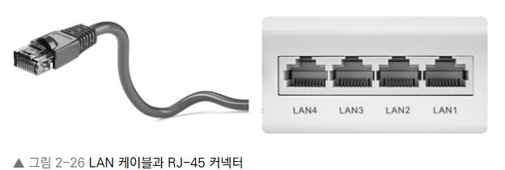

# Chapter 2 네트워크

- 네트워크 : 컴퓨터 등의 장치들이 통신 기술을 이용하여 구축하는 연결망

## Section 1 네트워크의 기초

- 네트워크 : 노드(node)와 링크(link)가 서로 연결되어 있으며 리소스를 공유하는 집합을 의미
- 노드는 서버, 라우터, 스위치 등 네트워크 장치를 의미하고, 링크는 유선 또는 무선을 의미한다.

### 2.1.1 처리량과 지연 시간

- 네트워크를 구축할 때 '많은 처리량을 처리할 수 있으며 지연 시간이 짧고 장애 빈도가 적으며 좋은 보안을 갖춘' 좋은 네트워크로 만드는 것이 중요하다.

#### 처리량(throughput)

- 처리량 : 링크 내에서 성공적으로 전달된 데이터의 양, 보통 얼만큼의 트래픽을 처리했는지를 나타낸다.
- 많은 트래픽을 **처리**한다' = '많은 처리량을 가진다.'

  

- 단위는 bps(bits per second)로 초당 전송 또는 수신되는 비트 수
- 처리량은 사용자들이 많이 접속할 때마다 커지는 트래픽, 네트워크 장치 간의 대역폭, 네트워크 중간에 발생하는 에러, 장치의 하드웨어 스펙에 영향을 받는다.
- 트래픽 : 특정 시점에 링크 내에 '흐르는' 데이터의 양 - 트래픽이 많아졌다. = 흐르는 데이터가 많아졌다. - 처리량이 많아졌다. = 처리되는 트래픽이 많아졌다.
<pre>
대역폭 : 주어진 시간동안 네트워크 연결을 통해 흐를 수 있는 최대 비트 수
</pre>

#### 지연시간(latency)

- 지연 시간 : 요청이 처리되는 시간을 말하며, 어떤 메시지가 두 장치 사이를 왕복하는 데 걸린 시간

  

- 지연 시간은 매체 타입(무선, 유선), 패킷 크기, 라우터의 패킷 처리 시간에 영향을 받는다.

### 2.1.2 네트워크 토폴로지와 병목 현상

#### 네트워크 토폴로지(network topology)

- 네트워크 토폴로지 : 노드와 링크가 어떻게 배치되어 있는지에 대한 방식이자 연결 형태

- <트리 토폴로지>

  - 트리 토폴로지는 계층형 토폴로지라고 하며 트리 형태로 배치한 네트워크 구성을 말한다.

    

  - 노드의 추가, 삭제가 쉬우며 특정 노드에 트래픽이 집중될 때 하위 노드에 영향을 끼칠 수 있다.

- <버스 토폴로지>

  - 버스 토폴로지(bus topology)는 중앙 통신 회선 하나에 여러 개의 노드가 연결되어 공유하는 네트워크 구성을 말하며 근거리 통신망(LAN)에서 사용한다.

    

  - 설치 비용이 적고 신뢰성이 우수하며 중앙 통신 회선에 노드를 추가하거나 삭제하기 쉽다.
    하지만 스푸핑이 가능한 문제점이 있다.

  - **스푸핑** : LAN 상에서 송신부의 패킷을 송신과 관련 없는 다른 호스트에 가지 않도록 하는 스위치 기능을 마비시키거나 속여서 특정 노드에 해당 패킷이 오도록 처리하는 것을 말한다.
    

- <스타 토폴로지>

  - 스타(star, 성형) 토폴로지는 중앙에 있는 노드에 모두 연결된 네트워크 구성을 말한다.

    

  - 노드를 추가하거나 에러를 탐지하기 쉽고 패킷의 충돌 발생 가능성이 적다.
  - 어떠한 노드에 장애가 발생해도 쉽게 에러를 발견할 수 있으며 장애 노드가 중앙 노드가 아닐 경우 다른 노드에 영향을 끼치는 것이 적다.
  - 하지만 중앙 노드에 장애가 발생하면 전체 네트워크를 사용할 수 없고 설치 비용이 고가이다.

- <링형 토폴로지>

  - 링형(ring) 토폴로지는 각각의 노드가 양 옆의 두 노드와 연결하여 전체적으로 고리처럼 하나의 연속된 길을 통해 통신을 하는 망 구성 방식이다.

    

  - 데이터는 노드에서 노드로 이동하게 되며, 각각의 노드는 고리 모양의 길을 통해 패킷을 처리한다.
  - 노드 수가 증가되어도 네트워크상의 손실이 거의 없고 충돌이 발생되는 가능성이 적고 노드의 고장 발견을 쉽게 찾을 수 있다.
  - 하지만 네트워크 구성 변경이 어렵고 회선에 장애가 발생하면 전체 네트워크에 영향을 크게 끼치는 단점이 있다.

- <메시 토폴로지>

  - 메시(mesh) 토폴로지는 망형 토폴로지라고도 하며 그물망처럼 연결되어 있는 구조이다.

    

  - 한 단말 장치에 장애가 발생해도 여러 개의 경로가 존재하므로 네트워크를 계속 사용할 수 있고 트래픽도 분산 처리가 가능하다.
  - 하지만 노드의 추가가 어렵고 구축 비용과 운용 비용이 고가인 단점이 있다.

#### 병목 현상

- 토폴로지가 중요한 이유는 병목 현상을 찾을 때 중요한 기준이 되기 때문이다!
- 병목 현상(bottleneck) : 전체 시스템의 성능이나 용량이 하나의 구성 요소로 인해 제한을 받는 현상을 말한다.
  - 예) 병의 몸통보다 병의 목 부분 내부 지름이 좁아서 물이 상대적으로 천천히 쏟아지는 것에 비유할 수 있다.
  - 서비스에서 이벤트를 열었을 때 트래픽이 많이 생기고 그 트래픽을 잘 관리하지 못하면 병목 현상이 생겨 사용자는 웹 사이트로 들어가지 못한다.

### 2.1.3 네트워크 분류

- 규모를 기반으로 사무실과 개인적으로 소유 가능한 규모인 LAN(Local Area Network)과 서울시 등 시 정도의 규모인 MAN(Metropolitan Area Network), 그리고 세계 규모의 WAN(Wide Area Network)로 분류할 수 있다.
  
- **LAN(Local Area Network)** : 근거리 통신망을 의미하며 같은 건물이나 캠퍼스 같은 좁은 공간에서 운영된다. 전송 속도가 빠르고 혼잡하지 않다.
- **MAN(Metropolitan Area Network)** : 대도시 지역 네트워크를 나타내며 도시 같은 넓은 지역에서 운영된다. 전송 속도는 평균이며 LAN보다는 더 많이 혼잡하다.
- **WAN(Wide Area Network)** : 광역 네트워크를 의미하며 국가 또는 대륙 같은 더 넓은 지역에서 운영된다. 전송 속도는 낮으며 MAN보다 더 혼잡하다.

### 2.1.4 네트워크 성능 분석 명령어

- 애플리케이션 코드 상에는 전혀 문제가 없는데 사용자가 서비스로부터 데이터를 가져오지 못하는 상황이 발생되기도 하며, 이는 네트워크 병목 현상일 가능성이 있다!!
- 네트워크 병목 현상의 주요 원인
  - 네트워크 대역폭
  - 네트워크 토폴로지
  - 서버 CPU, 메모리 사용량
  - 비효율적인 네트워크 구성
- 이때는 네트워크 관련 테스트와 네트워크와 무관한 테스트를 통해 '네트워크로부터 발생한 문제점'인 것을 확인한 후 네트워크 성능 분석을 해봐야 한다. 이때 사용되는 명령어는 다음과 같다.

  - Ping(Packet INternet Groper) : 네트워크 상태를 확인하려는 대상 노드를 향해 일정 크기의 패킷을 전송하는 명령어.

    - 해당 노드의 패킷 수신 상태와 도달하기까지 시간 등을 알 수 있으며 해당 노드까지 네트워크가 잘 연결되어 있는지 확인할 수 있다.
    - ping은 TCP/IP 프로토폴 중 ICMP 프로토콜을 통해 동작하며, ICMP 프로토폴을 지원하지 않는 기기를 대상으로는 실행할 수 없거나 네트워크 정책상 ICMP나 traceroute를 차단하는 대상의 경우 ping 테스팅은 불가하다.
    - ping [IP 주소 또는 도메인 주소]

      
      
      -n 12 옵션을 넣어서 12번의 패킷을 보내고 12번의 패킷을 받는 모습

  - netstat : 접속되어 있는 서비스들의 네트워크 상태를 표시하는 데 사용되며 네트워크 접속, 라우팅 테이블, 네트워크 프로토콜 등 리스트를 보여준다. 주로 서비스의 포트가 열려 있는지 확인할 때 쓴다.

    

  - nslookup : DNS에 관련된 내용을 확인하기 위해 쓰는 명령어. 특정 도메인에 매핑된 IP를 확인하기 위해 사용한다.

    

  - tracert : 윈도우에서는 tracert이고 리눅스에서는 traceroute라는 명령어로 구동된다. 이것은 목적지 노드까지 네트워크 경로를 확인할 때 사용하는 명령어이다. 목적지 노드까지 구간들 중 어느 구간에서 응답 시간이 느려지는지 등을 확인할 수 있다.

    

  - 이외에도 ftp를 통해 대형 파일을 전송하여 테스팅하거나 tcpdump를 통해 노드로 오고 가는 패킷을 캡처하는 등의 명령어가 있으며 네트워크 분석 프로그램으로는 wireshark, netmon이 있다.

### 2.1.5 네트워크 프로토콜 표준화

- 네트워크 프로토콜 : 다른 장치들끼리 데이터를 주고받기 위해 설정된 공통된 인터페이스를 말한다.
- IEEE 또는 IETF라는 표준화 단체가 이를 정한다.
- IEEE802.3은 유선 LAN 프로토콜로, 유선으로 LAN을 구축할 때 쓰이는 프로토콜이다. 이를 통해 만든 기업이 다른 장치라도 서로 데이터를 수신할 수 있게 된다.
- 예) 웹을 접속할 때 쓰이는 HTTP는 '서로 약속된' 인터페이스인 HTTP라는 프로토콜을 통해 노드들은 웹 서비스를 기반으로 데이터를 주고받을 수 있다.

## Section 2 TCP/IP 4계층 모델

- 인터넷 프로토폴 스위트(internet protocol suite) : 인터넷에서 컴퓨터들이 서로 정보를 주고받는 데 쓰이는 프로토콜의 집합이며, 이를 TCP/IP 4계층 모델로 설명하거나 OSI 7계층 모델로 설명하기도 한다.
- TCP/IP(Transmission Control Protocol/Internet Protocol) 4계층 모델은 네트워크에서 사용되는 통신 프로토콜의 집합으로 계층들은 프로토콜의 네트워킹 범위에 따라 네 개의 추상화 계층으로 구성된다.

### 2.2.1 계층 구조

- TCP/IP 계층은 4 개의 계층을 가지고 있으며 OSI 7계층과 많이 비교한다.
  
- 이 계층들은 특정 계층이 변경되었을 때 다른 계층이 영향을 받지 않도록 설계되었다.
- 예) 전송 계층에서 TCP를 UDP로 변경했다고 해서 인터넷 웹 브라우저를 다시 설치해야 하는 것은 아니듯 유연하게 설계됨
  

#### 애플리케이션 계층

애플리케이션(application) 계층 : FTP,HTTP,SSH,SMTP,DNS 등 응용 프로그램이 사용되는 프로토콜 계층이며 웹 서비스, 이메일 등 서비스를 실질적으로 사람들에게 제공하는 층이다.

- FTP : 장치와 장치 간의 파일을 전송하는 데 사용되는 표준 통신 프로토콜
- SSH : 보안되지 않은 네트워크에서 네트워크 서비스를 안전하게 운영하기 위한 암호화 네트워크 프로토콜
- HTTP : World Wide Web을 위한 데이터 통신의 기초이자 웹 사이트를 이용하는 데 쓰는 프로토콜
- SMTP : 전자 메일 전송을 위한 인터넷 표준 통신 프로토콜

- DNS : 도메인 이름과 IP 주소를 매핑해주는 서버
  - 예) www.naver.com에 DNS 쿼리가 오면 [Root DNS] -> [.com DNS] -> [.naver DNS] -> [.www DNS] 과정을 거쳐 완벽한 주소를 찾아 IP 주소를 매핑한다. 이를 통해 IP 주소가 바뀌어도 사용자들에게 똑같은 도메인 주소로 서비스할 수 있다.

#### 전송 계층

- 전송(transfer) 계층 : 송신자와 수신자를 연결하는 통신 서비스를 제공하며 연결 지향 데이터 스트림 지원, 신뢰성, 흐름 제어를 제공할 수 있으며 애플리케이션과 인터넷 계층 사이의 데이터가 전달될 때 중계 역할을 한다. 대표적으로 TCP와 UDP가 있다.
- TCP : 패킷 사이의 순서를 보장하고 연결지향 프로토콜을 사용해서 연결을 하여 신뢰성을 구축해서 수신 여부를 확인하여 '가상회선 패킷 교환 방식'을 사용한다.
- UDP : 순서를 보장하지 않고 수신 여부를 확인하지 않으며 단순히 데이터만 주는 '데이터그램 패킷 교환 방식'을 사용한다.

##### <가상회선 패킷 교환 방식> : 각 패킷에는 가상회선 식별자가 포함되며 모든 패킷을 전송하면 가상회선이 해제되고 패킷들은 전송된 '순서대로' 도착하는 방식

##### <데이터그램 패킷 교환 방식> : 패킷이 독립적으로 이동하며 최적의 경로를 선택하여 가는데, 하나의 메시지에서 분할된 여러 패킷은 서로 다른 경로로 전송될 수 있으며 도착한 '순서가 다를 수' 있는 방식을 뜻한다.

##### <TCP 연결 성립 과정>

TCP는 신뢰성을 확보할 때 '3-웨이 핸드셰이크(3-way handshake)'라는 작업을 진행한다.

(1) SYN 단계 : 클라이언트는 서버에 클라이언트의 ISN을 담아 SYN을 보낸다. ISN은 새로운 TCP 연결의 첫 번째 패킷에 할당된 임의의 시퀀스 번호를 말하며(예시로 12010을 듦) 이는 장치마다 다를 수 있다.
(2) SYN + ACK 단계 : 서버는 클라이언트의 SYN을 수신하고 서버의 ISN을 보내며 승인번호로 클라이언트 ISN + 1을 보낸다.
(3) ACK 단계 : 클라이언트는 서버의 ISN + 1한 값인 승인번호를 담아 ACK를 서버에 보낸다.

이렇게 3-way handshake 과정 이후 신뢰성이 구축되고 데이터 전송을 시작한다.

- TCP는 이 과정이 있기 떄문에 신뢰성이 있는 계층이라고 하며 UDP는 이 과정이 없기 때문에 신뢰성이 없는 계층이라고 한다.
<pre>- SYN : SYNchronization의 약자, 연결 요청 플래그
- ACK : ACKnowledgement의 약자, 응답 플래그
- ISN : Initial Sequence Numbers의 약어, 초기 네트워크 연결을 할 때 할당된 32비트 고유 시퀀스 번호이다.</pre>

##### <TCP 연결 해제 과정>

TCP가 연결을 해제할 때는 4-웨이 핸드셰이크(4-way handshake) 과정이 발생한다.

(1) 1번 : 먼저 클라이언트가 연결을 닫으려고 할 때 FIN으로 설정된 세그먼트를 보낸다. 그리고 클라이언트는 FIN_WAIT_1 상태로 들어가고 서버의 응답을 기다린다.
(2) 2번 : 서버는 클라이언트로 ACK라는 승인 세그먼트를 보낸다. FIN_WAIT_2 상태에 들어간다
(3) 3번 : 서버는 ACK를 보내고 일정 시간 이후에 클라이언트에 FIN이라는 세그먼트를 보낸다.
(4) 4번 : 클라이언트는 TIME_WAIT 상태가 되고 다시 서버로 ACK를 보내서 서버는 CLOSED 상태가 된다. 이후 클라이언트는 어느 정도의 시간을 대기한 후 연결이 닫히고 클라이언트와 서버의 모든 자원의 연결이 해제된다.

- **TIME_WAIT**이 중요함. 굳이 일정 시간 뒤에 닫는 이유?
  1. 지연 패킷이 발생할 경우를 대비하기 위함이다. 패킷이 뒤늦게 도달하고 이를 처리하지 못한다면 데이터 무결성 문제가 발생함. ex) 전체 데이터가 100 일 때 일부 데이터만 50만 들어오는 현상이 발 생할 수도 있음
  2. 두 장치가 연결이 닫혔는지 확인하기 위해서이다. 만약 LAST_ACK 상태에서 닫히게 되면 다른 새로운 연결을 하려고 할 때 장치는 줄곧 LAST_ACK으로 되어 있기 때문에 접속 오류가 나타나게 됨.
- TIME_WAIT : 소켓이 바로 소멸되지 않고 일정 시간 유지되는 상태. 지연 패킷 등의 문제점을 해결하는데 쓰인다. CentOS5, 우분투에는 60초로, 윈도우는 4분으로 설정되어 있다.
- 데이터 무결성(data integrity) : 데이터의 정확성과 일관성을 유지하고 보증하는 것

#### 인터넷 계층

인터넷(internet) 계층 : 장치로부터 받은 네트워크 패킷을 IP 주소로 지정된 목적지로 전송하기 위해 사용된 계층

- IP,ARP,ICMP 등이 있으며 패킷을 수신해야 할 상대의 주소를 지정하여 데이터를 전달한다.
- 상대방이 제대로 받았는지에 대해 보장하지 않는 **비연결형적인** 특징을 가지고 있다.

#### 링크 계층

링크 계층 : 전선, 광섬유, 무선 등으로 실질적인 데이터를 전달하며 장치 간에 신호를 주고 받는 '규칙'을 정하는 계층, 네트워크 접근 계층이라고도 한다.

- 이를 물리 계층과 데이터 링크 계층으로 나누기도 하는데, 물리 계층은 무선 LAN과 유선 LAN을 통해 0과 1로 이루어진 데이터를 보내는 계층을 말하며, 데이터 링크 계층은 '이더넷 프레임'을 통해 에러 확인, 흐름 제어, 접근 제어를 담당하는 계층을 말한다.

##### 유선 LAN(IEEE802.3)> : 전이중화 통신을 쓴다.

전이중화 통신(full duplex) : 양쪽 장치가 동시에 송수신할 수 있는 방식을 말한다. 이는 송신로와 수신로로 나눠서 데이터를 주고받으며 현대의 고속 이더넷은 이 방식을 기반으로 통신하고 있다.

**CSMA/CD**

참고로 이전에는 유선 LAN에 '반이중화 통신' 중 하나인 CSMA/CD(Carrier Sense Multiple Access with Collision Detection) 방식을 썻다. 이 방식은 데이터를 '보낸 이후' 충돌이 발생한다면 일정 시간 이후 재전송하는 방식을 말한다. 이는 수신로와 송신로를 각각 둔 것이 아니고 한 경로를 기반으로 데이터를 보내기 때문에 데이터를 보낼 때 충돌에 대해 대비해야 했기 때문이다.

##### <유선 LAN을 이루는 케이블>

TP 케이블이라고 하는 트위스트 페어 케이블과 광섬유 케이블이 대표적이다.

**트위스트 페어 케이블(twisted pair cable)** : 하나의 케이블처럼 보이지만 실제로는 여덟 개의 구리선을 두 개씩 꼬아서 묶은 케이블을 지칭한다. 케이블은 구리선을 실드 처리하지 않고 덮은 UTP 케이블과 실드 처리하고 덮은 STP로 나눠진다. 여기서 우리가 많이 볼 수 있는 케이블은 UTP 케이블로 흔히 LAN 케이블이라고 한다. 참고로 이 LAN 케이블을 꽂을 수 있는 커넥터를 RJ-45 커넥터라고 한다.

**광섬유 케이블** : 광섬유로 만든 케이블이다. 레이저를 이용해서 통신하기 때문에 구리선과는 비교할 수 없을 만큼의 장거리 및 고속 통신이 가능하다. 보통 100Gbps의 데이터를 전송하며 다음 그림처럼 광섬유 내부와 외부를 다른 밀도를 가지는 유리나 플라스틱 섬유로 제작해서 한 번 들어간 빛이 내부에서 계속적으로 반사하며 전진하여 반대편 끝까지 가는 원리를 이용한 것이다. 참고로 빛의 굴절률이 높은 부분은 코어(core)라고 하며 낮은 부분은 클래딩(cladding)이라고 한다.

##### <무선 LAN(IEEE802.11)>

수신과 송신에 같은 채널을 사용하기 때문에 반이중화 통신을 사용한다.

반이중화 통신(half duplex) : 양쪽 장치는 서로 통신할 수 있지만, 동시에는 통신할 수 없으며 한 번에 한 방향만 통신할 수 있는 방식을 말한다.

- 일반적으로 장치가 신호를 수신하기 시작하면 응답하기 전에 전송이 완료될 때까지 기다려야 한다. 또한, 둘 이상의 장치가 동시에 전송하면 충돌이 발생하여 메시지가 손실되거나 왜곡될 수 있기 때문에 충돌 방지 시스템이 필요하다.

**CSMA/CA**

CSMA/CA는 반이중화 통신 중 하나로 장치에서 데이터를 보내기 전에 일렬의 과정을 기반으로 사전에 가능한 한 충돌을 방지하는 방식을 말한다.

- CSMA/CA로 프레임을 보낼 때 일어나는 과정
  1. 사용 중인 채널이 있다면 다른 채널을 감지하다 유후 상태인 채널을 발견한다.
  2. 프레임 간 공간 시간인 IFS(InterFrame Space) 시간만큼 기다린다. IFS는 프레임의 우선순위를 정의할 때도 사용된다. IFS가 낮으면 우선순위가 높다.
  3. 프레임을 보내기 전 0 ~ 2^k -1 사이에서 결정된 랜덤 상수를 기반으로 결정된 시간만큼 기다린 뒤 프레임을 보낸다. 프레임을 보낸 뒤 제대로 송신이 되었고 ACK 세그먼트를 받았다면 마친다. 그러나 받지 못했다면 k = k+1을 하며 이 과정을 반복한다. 반복하다 K가 정해진 Kmax보다 더 커진다면 해당 프레임전송은 버린다.(abort)
- 참고로 이와 반대되는 전이중화 통신은 양방향 통신이 가능하므로 충돌 가능성이 없기 때문에 충돌을 감지하거나 방지하는 메커니즘은 필요하지 않다.

##### <무선 LAN을 이루는 주파수>

무선 LAN(WLAN, Wireless Local Area Network)은 무선 신호 전달 방식을 이용하여 2대 이상의 장치를 연결하는 기술이다.

- 비유도 매체인 공기에 주파수를 쏘아 무선 통신망을 구축하는데, 주파수 대역은 2.4GHz 대역 또는 5GHz 대역 중 하나를 써서 구축한다.
- 2.4GHz는 장애물에 강한 특성을 가지고 있지만 전자레인지, 무선 등 전파 간섭이 일어나는 경우가 많고 5GHz 대역은 사용할 수 있는 채널 수도 많고 동시에 사용할 수 있기 때문에 상대적으로 깨끗한 전파 환경을 구축할 수 있다. 따라서 보통은 5GHz 대역을 사용하는 것이 좋다.

**와이파이** : 전자기기들이 무선 LAN 신호에 연결할 수 있게 하는 기술로, 이를 사용하려면 무선 접속 장치(AP, Access Point)가 있어야 한다. 흔히 이를 공유기라고 하며, 이를 통해 유선 LAN에 흐르는 신호를 무선 LAN 신호로 바꿔주어 신호가 닿는 범위 내에서 무선 인터넷을 사용할 수 있게 된다. 참고로 무선 LAN을 이용한 기술로는 지그비, 블루투스 등이 있다.

**BSS** : BSS(Basic Service Set)은 기본 서비스 집합을 의미하며, 단순 공유기를 통해 네트워크에 접속하는 것이 아닌 동일 BSS 내에 있는 AP들과 장치들이 서로 통신이 가능한 구조를 말한다. 근거리 무선 통신을 제공하고, 하나의 AP만을 기반으로 구축이 되어 있어 사용자가 한 곳에서 다른 곳으로 자유롭게 이동하며 네트워크에 접속하는 것을 불가능하다.

**ESS(Extended Service Set)** : 하나 이상의 연결된 BSS 그룹이다. 장거리 무선 통신을 제공하며 BSS보다 더 많은 가용성과 이동성을 지원한다. 즉, 사용자는 한 장소에서 다른 장소로 이동하며 중단 없이 네트워크에 계속 연결할 수 있다.

##### <이더넷 프레임>

참고로 데이터 링크 계층은 이더넷 프레임을 통해 전달받은 데이터의 에러를 검출하고 캡슐화하며 다음과 같은 구조를 가진다.

- MAC 주소 : 컴퓨터나 노트북 등 각 장치에는 네트워크에 연결하기 위한 장치(LAN 카드)가 있는데, 이를 구별하기 위한 식별번호를 말한다. 6바이트(48비트)로 구성된다.

#### 계층 간 데이터 송수신 과정

HTTP를 통해 웹 서버에 있는 데이터를 요청한다면?

애플리케이션 계층에서 전송 계층으로 필자가 보내는 요청(request) 값들이 캡슐화 과정을 거쳐 전달되고, 다시 링크 계층을 통해 해당 서버와 통신을 하고, 해당 서버의 링크 계층으로부터 애플리케이션까지 비캡슐화 과정을 거쳐 데이터가 전송된다.

<캡슐화 과정> : 상위 계층의 헤더와 데이터를 하위 계층의 데이터 부분에 포함시키고 해당 계층의 헤더를 삽입하는 과정을 말한다.

- 애플리케이션 계층의 데이터가 전송 계층으로 전달되면서 '세그먼트' 또는 '데이터그램'화되며 TCP(L4) 헤더가 붙여지게 된다.
- 그리고 이후 인터넷 계층으로 가면서 IP(L3) 헤더가 붙여지게 되며 '패킷'화가 되고,
- 이후 링크 계층으로 전달되면서 프레임 헤더와 프레임 트레일러가 붙어 '프레임'화가 된다.

- <비캡슐화 과정> : 하위 계층에서 상위 계층으로 가며 각 계층의 헤더 부분을 제거하는 과정을 말한다.

- 캡슐화된 데이터를 받게 되면 링크 계층에서부터 타고 올라오면서 프레임화된 데이터는 다시 패킷화를 거쳐 세그먼트, 데이터그램화를 거쳐 메시지화가 되는 비캡슐화 과정이 일어난다.
- 그 이후 최종적으로 사용자에게 애플리케이션의 PDU인 메시지로 전달된다.

### 2.2.2 PDU

PDU(Protocol Data Unit) : 네트워크의 어떠한 계층에서 계층으로 데이터가 전달될 때 한 덩어리의 단위
PDU는 제어 관련 정보들이 포함된 '헤더', 데이터를 의미하는 '페이로드'로 구성되어 있으며 계층마다 부르는 명칭이 다르다.

- 애플리케이션 계층 : 메시지
- 전송 계층 : 세그먼트(TCP), 데이터그램(UDP)
- 인터넷 계층 : 패킷
- 링크 계층 : 프레임(데이터 링크 계층), 비트 (물리 계층)

예시) 애플리케이션 계층은 '메시지'를 기반으로 데이터를 전달하는데, HTTP의 헤더가 문자열인 것

- curl commands 온라인 사이트 링크 : https://reqbin.com/curl
- curl www.naver.com 명령어로 요청하면 다음과 같은 응답(response) 헤더 값이 나오는데, 이는 모두 문자열이다.

  

- 참고로 PDU 중 아래 계층인 비트로 송수신하는 것이 모든 PDU 중 가장 빠르고 효율성이 높다. 하지만 애플리케이션 계층에서는 문자열을 기반으로 송수신을 하는데, 그 이유는 헤더에 authorization 값 등 다른 값들을 넣는 확장이 쉽기 때문이다.

## Section 3 네트워크 기기

네트워크는 여러 개의 네트워크 기기를 기반으로 구축된다.

### 2.3.1 네트워크 기기의 처리 범위

네트워크 기기는 계층별로 처리 범위를 나눌 수 있다.
물리 계층을 처리할 수 있는 기기와 데이터 링크 계층을 처리할 수 있는 기기 등이 있다. 그리고 상위 계층을 처리하는 기기는 하위 계층을 처리할 수 있지만 그 반대는 불가능하다.

- 애플리케이션 계층 : L7 스위치
- 인터넷 계층 : 라우터, L3 스위치
- 데이터 링크 계층 : L2 스위치, 브리지
- 물리 계층 : NIC, 리피터, AP

예) L7 스위치는 애플리케이션 계층을 처리하는 기기로, 그 밑의 모든 계층의 프로토콜을 처리할 수 있지만, AP는 물리 계층밖에 처리하지 못한다.

### 2.3.2 애플리케이션 계층을 처리하는 기기

#### L7 스위치

스위치는 여러 장비를 연결하고 데이터 통신을 중재하며 목적지가 연결된 포트로만 전기 신호를 보내 데이터를 전송하는 통신 네트워크 장비다.

- L7 스위치는 로드밸런서라고도 하며, 서버의 부하를 분산하는 기기다. 클라이언트로부터 오는 요청들을 뒤쪽의 여러 서버로 나누는 역할을 하며 시스템이 처리할 수 있는 트래픽 증가를 목표로 한다.
- URL, 서버, 캐시, 쿠키들을 기반으로 트래픽을 분산한다. 또한, 바이러스, 불필요한 외부 데이터 등을 걸러내는 필터링 기능 또한 가지고 있으며 응용 프로그램 수준의 트래픽 모니터링도 가능하다.
- 만약 장애가 발생한 서버가 있다면 이를 트래픽 분산 대상에서 제외해야 하는데, 이는 정기적으로 헬스 체크(health check)를 이용하여 감시하면서 이루어진다.

##### <L4 스위치와 L7 스위치 차이>

로드밸러서로는 L7 스위치뿐만 아니라 L4 스위치도 있다. L4 스위치는 전송 계층을 처리하는 기기로 스트리밍 관련 서비스에서는 사용할 수 없으며 메시지를 기반으로 인식하지 못하고 IP와 포트를 기반으로(특히 포트를 기반으로) 트래픽을 분산한다. 반면 L7 로드밸런서는 IP, 포트 외에도 URL, HTTP 헤더, 쿠키 등을 기반으로 트래픽을 분산한다.

참고로 클라우드 서비스(AWS 등)에서 L7 스위치를 이용한 로드밸런싱은 ALB(Application Load Balancer) 컴포넌트로 하며, L4 스위치를 이용한 로드밸런싱은 NLB(Network Load Balancer) 컴포넌트로 한다.

##### <헬스 체크>

L4 스위치 또는 L7 스위치 모두 헬스 체크를 통해 정상적인 서버 또는 비정상적인 서버를 판별하는데, 헬스 체크는 전송 주기와 재전송 횟수 등을 설정한 이후 반복적으로 서버에 요청을 보내는 것을 말한다.

물론 이때 서버에 부하가 되지 않을 만큼 요청 횟수가 적절해야 한다. TCP, HTTP 등 다양한 방법으로 요청을 보내며 이 요청이 정상적으로 이루어졌다면 정상적인 서버로 판별한다. 예를 들어 TCP 요청을 보냈는데 3-웨이 핸드셰이크가 정상적으로 일어나지 않았다면 정상이 아닌 것.

##### <로드밸런서를 이용한 서버 이중화>

로드밸런서의 대표적인 기능으로 서버 이중화를 들 수 있다. 서비스를 안정적으로 운용하기 위해서는 2대 이상의 서버는 필수적이다. 에러가 발생하여 서버 1대가 종료되더라도 서비스를 안정적으로 운용되어야 하기 때문이다.

로드밸런서는 2대 이상의 서버를 기반으로 가상 IP를 제공하고 이를 기반으로 안정적인 서비스를 제공한다.

### 2.3.3 인터넷 계층을 처리하는 기기

인터넷 계층을 처리하는 기기로는 라우터, L3 스위치가 있다.

#### 라우터

라우터(router) : 여러 개의 네트워크를 연결, 분할, 구분시켜주는 역할을 하며 "다른 네트워크에 존재하는 장치끼리 서로 데이터를 주고받을 때 패킷 소모를 최소화하고 경로를 최적화하여 최소 경로로 패킷을 포워딩"하는 라우팅을 하는 장비다.

#### L3 스위치

L3 스위치 : L2 스위치의 기능과 라우팅 기능을 갖춘 장비. L3 스위치를 라우터라고 해도 무방하다.

라우터는 소프트웨어 기반의 라우팅과 하드웨어 기반의 라우팅을 하는 것으로 나눠지고 하드웨어 기반의 라우팅을 담당하는 장치를 L3 스위치라고 한다.

### 2.3.4 데이터 링크 계층을 처리하는 기기

데이터 링크 계층을 처리하는 기기로는 L2 스위치와 브리지가 있다.

#### L2 스위치

L2 스위치 : 장치들의 MAC 주소를 MAC 주소 테이블을 통해 관리하며, 연결된 장치로부터 패킷이 왔을 때 패킷 전송을 담당한다.

IP 주소를 이해하지 못해 IP 주소를 기반으로 라우팅은 불가능하며 단순히 패킷의 MAC 주소를 읽어 스위칭하는 역할을 한다.

목적지가 MAC 주소 테이블에 없다면 전체 포트에 전달하고 MAC 주소 테이블의 주소는 일정 시간 이후 삭제하는 기능도 있다.

#### 브리지

브리지(bridge) : 두 개의 근거리 통신방(LAN)을 상호 접속할 수 있도록 하는 통신망 연결 장치로, 포트와 포트 사이의 다리 역할을 하며 장치에서 받아온 MAC 주소를 MAC 주소 테이블로 관리한다.

브리지는 통신망 범위를 확장하고 서로 다른 LAN 등으로 이루어진 '하나의' 통신망을 구축할 때 쓰인다.

### 2.3.5 물리 계층을 처리하는 기기

물리 계층을 처리하는 기기는 NIC, 리피터, AP가 있다.

#### NIC

LAN 카드라고 하는 네트워크 인터페이스 카드(NIC, Network Interface Card)는 2대 이상의 컴퓨터 네트워크를 구성하는 데 사용하며, 네트워크와 빠른 속도로 데이터를 송수신할 수 있도록 컴퓨터 내에 설치하는 확장 카드이다.

각 LAN 카드에는 각각을 구분하기 위한 고유의 식별번호인 MAC 주소가 있다.

#### 리피터

리피터(repeater) : 들어오는 약해진 신호 정도를 증폭하여 다른 쪽으로 전달하는 장치

이를 통해 패킷이 더 멀리 갈 수 있다. 하지만 이는 광케이블이 보급됨에 따라 현재는 잘 쓰이지 않는 장치다.

#### AP

AP(Access Point)는 패킷을 복사하는 기기다.
AP에 유선 LAN을 연결한 후 다른 장치에서 무선 LAN 기술(와이파이 등)을 사용하여 무선 네트워크 연결을 할 수 있다.
