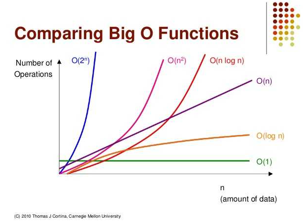
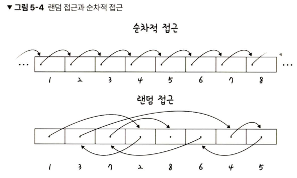
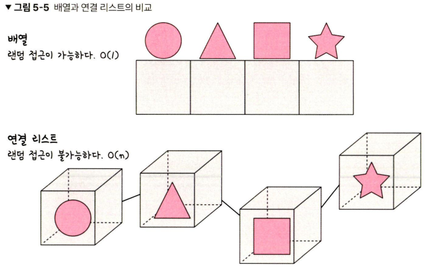
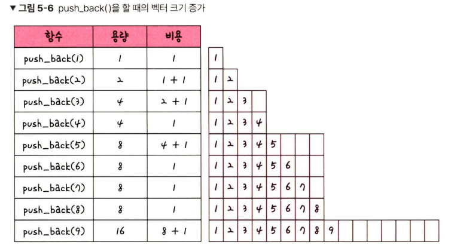
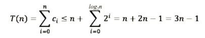
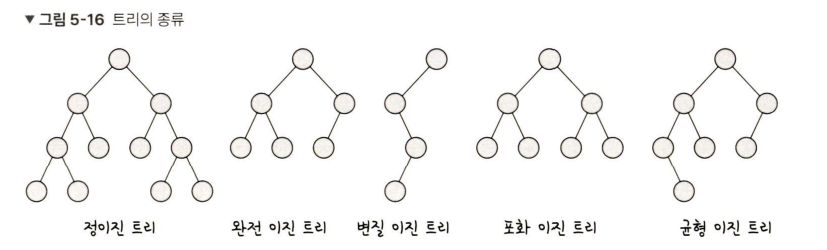
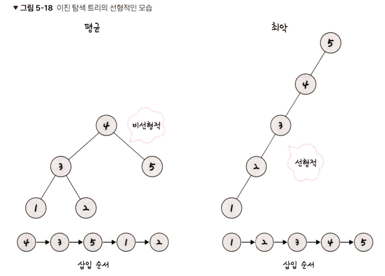
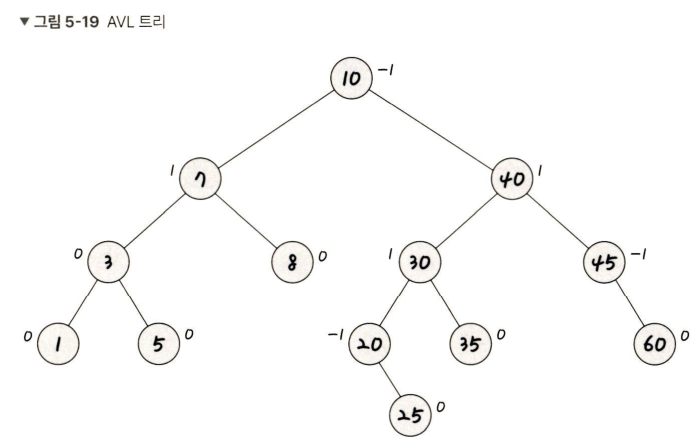
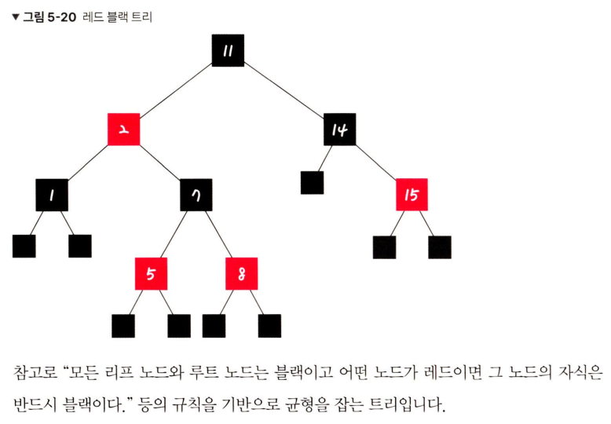

# 5. 자료구조
- **자료구조** : 효율적으로 데이터를 관리하고 수정, 삭제, 탐색, 저장할 수 있는 데이터 집합 
- **STL** : C++의 표준 템플릿 라이브러리이자 스택, 배열 등 데이터 구조의 함수 등을 제공하는 라이브러리의 묶음
## 5-1. 복잡도
복잡도는 시간 복잡도와 공간 복잡도로 나뉜다. 
### 5-1-1. 시간 복잡도
#### **C++의 기본**
```
#include <bits/stdc++.h > // --- (1)
using namespace std;       // --- (2)
string a;                  // --- (3)
int main(){
    cin >> a;              // --- (4)
    cout << a << "\n";     // --- (5)
    return 0;              // --- (6)
}
```
(1) 헤더 파일. STL 라이브러리를 import 한다. bits/stdc++.h는 모든 표준 라이브러리가 포함된 헤더이다. 

(2) std라는 네임스페이스를 사용한다는 뜻

(3) 문자열 선언

(4) 입력 (cin,scanf)

(5) 출력 (cout, printf)

(6) return 0 프로세스가 정상적으로 마무리됨을 뜻한다.

#### 빅오 표기법
**시간복잡도** : 입력 크기에 대해 어떠한 알고리즘이 실행되는 데 걸리는 시간

주요 로직의 반복 횟수를 중점으로 측정되며, 보통 빅오 표기법으로 나타낸다. 
```
for(int i=0;i<10;i++){
    for(int j=0;j<n;j++){
        for(int k=0;k<n;k++){
            if(true) cout << k << '\n';
        }
    }
}
for(int i=0;i<n;i++){
    if(true) cout << i << '\n';
}
```
위 코드의 시간복잡도 : 10n^2+n, O(n^2)

**빅오 표기법** : 입력 범위 n을 기준으로 해서 로직이 몇 번 반복되는지 나타내는 것. 이때 '가장 영향을 많이 끼치는' 항의 상수 인자를 빼고 나머지 항을 없애서 표현한다.

#### 시간복잡도의 속도 비교


O(n^2) 보다는 O(n), O(n)보다는 O(1)을 지향해야 한다. 

### 5-1-2. 공간 복잡도
**공간 복잡도** : 프로그램을 실행시켰을 때 필요로 하는 자원 공간의 양을 말한다. 정적 변수로 선언된 것 외에 동적으로 재귀적인 함수로 인해 공간을 계속해서 필요로 할 경우도 포함한다. 
```
int a[1004];
```
위 코드는 1004 * 4byte의 크기를 가지게 된다.

### 5-1-3. 자료구조에서의 시간 복잡도
자료구조를 쓸 때는 이러한 시간 복잡도를 잘 생각해야 한다.

<표 5-1 자료구조의 평균 시간 복잡도 >
| 자료구조 | 접근(access) | 탐색(search) | 삽입(insert) | 삭제(delete) |
|:-|:-|:-|:-|:-|
| 배열(array)                        |O(1)|O(n)|O(n)|O(n)|
| 스택(stack)                        |O(n)|O(n)|O(1)|O(1)|
| 큐(queue)                          |O(n)|O(n)|O(1)|O(1)|
| 이중 연결 리스트(doubly linked list) |O(n)|O(n)|O(1)|O(1)|
| 해시 테이블(hash table)             |O(1)|O(1)|O(1)|O(1)|
| 이진 탐색 트리(BST)                 |O(logn)|O(logn)|O(logn)|O(logn)|
| AVL 트리                            |O(logn)|O(logn)|O(logn)|O(logn)|
| 레드 블랙 트리                      |O(logn)|O(logn)|O(logn)|O(logn)|

<표 5-2 자료구조의 최악의 시간 복잡도 >
| 자료구조 | 접근(access) | 탐색(search) | 삽입(insert) | 삭제(delete) |
|:-|:-|:-|:-|:-|
| 배열(array)                        |O(1)|O(n)|O(n)|O(n)|
| 스택(stack)                        |O(n)|O(n)|O(1)|O(1)|
| 큐(queue)                          |O(n)|O(n)|O(1)|O(1)|
| 이중 연결 리스트(doubly linked list) |O(n)|O(n)|O(1)|O(1)|
| **해시 테이블(hash table)**             |O(n)|O(n)|O(n)|O(n)|
| **이진 탐색 트리(BST)**                 |O(n)|O(n)|O(n)|O(n)|
| AVL 트리                            |O(logn)|O(logn)|O(logn)|O(logn)|
| 레드 블랙 트리                      |O(logn)|O(logn)|O(logn)|O(logn)|


## 5-2. 선형 자료 구조
**선형 자료 구조** : 일렬로 나열되어 있는 자료 구조

### 5-2-1. 연결 리스트 (linked list)
**연결리스트(linked list)** : 데이터를 감싼 노드를 포인터로 연결해서 공간적인 효율성을 극대화시킨 자료구조다. 삽입, 삭제가 O(1)이 걸리며 탐색에는 O(n)이 걸린다.


싱글 연결 리스트(Sinlge linked list), 이중 연결 리스트(doubly linked list), 원형 이중 연결 리스트가 있다. 

- 싱글 연결 리스트 : next 포인터만 가진다.
- 이중 연결 리스트 : next 포인터와 prev 포인터를 가진다.
- 원형 이중 연결 리스트 : 이중 연결 리스트와 같지만 마지막 노드의 next 포인터가 헤드 노드를 가리키는 것을 말한다.

이중 연결 리스트는 앞에서부터 요소를 넣는 push_front(), 뒤에서부터 요소를 넣는 push_back(), 중간에 요소를 넣는 insert() 등의 함수가 있다. 

```
#include <bits/stdc++.h>
using namespace std;
int main(){
    list<int> a;
    for (int i=0;i<10;i++) a.push_back(i);
    for (int i=0;i<10;i++) a.push_front(i);
    auto it = a.begin(); it++;
    a.insert(it, 1000);
    for (auto it: a) cout << it << " ";
    cout << '\n' ;
    a.pop_front();
    a.pop_back();
    for (auto it :a) cout << it << " ";
    cout << '\n';
    return 0;
}
/*
9 1000 8 7 6 5 4 3 2 1 0 0 1 2 3 4 5 6 7 8 9
1000 8 7 6 5 4 3 2 1 0 0 1 2 3 4 5 6 7 8 
*/
```

### 5-2-2. 배열 

**배열(array)** : 같은 타입의 변수들로 이루어져 있고, 크기가 정해져 있으며, 인접한 메모리 위치에 있는 데이터를 모아놓은 집합이다. 또한 중복을 허용하고 순서가 있다. 접근(참조)에 O(1)의 시간복잡도를 가지며 랜덤 접근(random access)이 가능하다. 삽입과 삭제에는 O(n)이 걸린다. **따라서 데이터 추가와 삭제를 많이 하는 것은 연결 리스트, 접근(참조)을 많이 하는 것은 배열로 하는 것이 좋다.** 

#### 랜덤 접근과 순차적 접근


랜덤 접근(직접 접근)은 동일한 시간에 배열과 같은 순차적인 데이터가 있을 때 임의의 인덱스에 해당하는 데이터에 접근할 수 있는 기능이다. 이는 데이터를 저장된 순서대로 검색해야 하는 순차적 접근과는 반대이다. 

#### 배열과 연결 리스트 비교


배열은 상자를 순서대로 나열한 데이터 구조이며 몇 번째 상자인지만 알면 해당 상자의 요소를 끄집어낼 수 있다. 

연결 리스트는 상자를 선으로 연결한 형태의 데이터 구조이며, 상자 안의 요소를 알기 위해서는 하나씩 상자 내부를 확인해봐야 한다는 점이 다르다. 

n번째 요소의 접근(참조)는 배열이 빠르고 연결 리스트는 느리다. 

데이터 추가 및 삭제는 연결 리스트가 더 빠르고 배열은 느리다. 배열은 모든 상자를 앞으로 옮겨야 추가가 가능하지만, 연결리스트는 선을 바꿔서 연결해주기만 하면 되기 때문이다. 

```
#include <bits/stdc++.h>
using namespace std;
int a[10];
int main(){
    for (int i=0; i<10; i++) a[i] = i;
    for (auto it : a) cout << it << " ";
    cout << '\n';
    return 0;
}
/*
0 1 2 3 4 5 6 7 8 9
*/
```

### 5-2-3. 벡터
**벡터(vector)** : 동적으로 요소를 할당할 수 있는 동적 배열이다. 컴파일 시점에 개수를 모른다면 벡터를 써야한다. 또한 중복을 허용하고 순서가 있고 랜덤 접근이 가능하다. 탐색과 맨 뒤의 요소를 삭제하거나 삽입하는 데 O(1)이 걸리며, 맨 뒤가 아닌 요소를 삭제하고 삽입하는 데 O(n)의 시간이 걸린다.

뒤에서부터 삽입하는 push_back()의 경우 O(1)의 시간이 걸리는데, 벡터의 크기가 증가되는 시간 복잡도가 amortized 복잡도, 즉 상수 시간 복잡도 O(1)과 유사한 시간 복잡도를 가지기 때문이다. 



push_back()을 할 때마다 증가하는 것이 아니라 2의 N제곱 + 1(2,3,5,9,...)마다 크기를 2배로 늘리는 것을 알 수 있다. 
ci를 i번째 push_back()을 할 때 드는 비용이라고 한다면, ci는 1 또는 1+2^k 인 것을 알 수 있다. 
n번 push_back()을 할 때의 비용 T(n)은 다음과 같다.


이를 n으로 나누게 되면 push_back()을 할 때 평균 비용을 알 수 있는데, 3이므로 이는 1이라는 상수 시간보다는 크지만 상수 시간에 가까운 amortized 복잡도를 가진다는 것을 알 수 있다. 따라서 push_back()은 O(1)의 시간 복잡도를 가진다고 할 수 있다. 

```
#include <bits/stdc++.h>
using namespace std;
vector<int> v;
int main(){
    for (int i=1; i<=10; i++) v.push_back(i);
    for (int a : v) cout << a << " ";
    cout << "\n";
    v.pop_back();
    
    for (int a : v) cout << a << " ";
    cout << "\n";
    
    v.erase(v.begin(), v.begin() +1);

    for (int a : v) cout << a << " ";
    cout << "\n";
    
    auto a = find(v.begin(), v.end(), 100);
    if (a==v.end()) cout << "not found" << "\n";
    
    fill(v.begin(), v.end(), 10);
    for (int a : v) cout << a << " ";
    cout << "\n";
    v.clear();
    for (int a : v) cout << a << " ";
    cout << "\n";
    
    return 0;
}
/*
1 2 3 4 5 6 7 8 9 10
1 2 3 4 5 6 7 8 9 
2 3 4 5 6 7 8 9 
not found
10 10 10 10 10 10 10 10 
*/
```


```
for (int a : v) cout << a << '\n';
for (int i=0; i<v.size();i++) cout << v[i] <<'\n';
// 위의 두 코드는 같은 뜻
```

위의 코드는 "벡터의 요소를 순차적으로 탐색한다."라는 뜻이며, 전자와 후자 코드는 같다. 

벡터 v에 pair라는 값이 들어간다면 <code>for (pair<int,int> a: v)</code> 방식으로 순회해야 한다. 

### 5-2-4. 스택 

**스택** : 가장 마지막으로 들어간 데이터가 가장 첫 번째로 나오는 성질(LIFO, Last In First Out)을 가진 자료구조

재귀적인 함수, 알고리즘에 사용되며 웹 브라우저 방문 기록 등에 쓰인다. 삽입 및 삭제에 O(1), 탐색에 O(n)이 걸린다.


```
#include <bits/stdc++.h>
using namespace std;
stack<int> stk;
int main(){
    ios_base::sync_with_stdio(false);
    cin.tie(NULL);
    for (int i=0;i<10;i++) stk.push(i);
    while(stk.size()){
        cout << stk.top() << " ";
        stk.pop();
    }
}
/*
9 8 7 6 5 4 3 2 1 0
*/
```

### 5-2-5. 큐

**큐** : 먼저 집어넣은 데이터가 먼저 나오는 성질(FIFO, First In First Out)을 지닌 자료구조이며, 스택과 반대되는 개념을 가진다. 삽입 및 삭제에 O(1), 탐색에 O(n)이 걸린다.

CPU 작업을 기다리는 프로세스, 스레드 행렬 또는 네트워크 접속을 기다리는 행렬, 너비 우선 탐색, 캐시 등에 사용된다. 

```
#include <bits/stdc++.h>
using namespace std;
int main(){
    queue<int> q;
    q.push(1);
    cout << q.front() << "\n";
    q.pop();
    cout << q.size() << "\n";
    return 0;
}
/*
1
0
*/
```
C++에서 enqueue()는 push()로, dequeue()는 pop()으로 구현되었다. 


## 5-3. 비선형 자료 구조

**비선형 자료 구조** : 일렬로 나열하지 않고 자료 순서나 관계가 복잡한 구조. 일반적으로 트리나 그래프를 말한다. 

### 5-3-1. 그래프
**그래프** : 정점과 간선으로 이루어진 자료 구조

#### 정점과 간선
어떠한 곳에서 어떠한 곳으로 무언가를 통해 간다고 했을 때 '어떠한 곳'은 정점(vertex), '무언가'는 간선(edge)가 된다. 

- 단방향 간선, 양방향 간선이 있다.
- 정점으로 나가는 간선은 해당 정점의 outdegree라고 하며, 들어오는 간선은 해당 정점의 indegree라고 한다. 
- 정점은 약자로 V 또는 U라고 하며, 보통 어떤 정점으로부터 시작해서 어떤 정점까지 간다를 "U에서부터 V로 간다."라고 표현한다. 
- 정점과 간선으로 이루어진 **집합**을 그래프(graph)라고 한다.

#### 가중치
- 가중치는 간선과 정점 사이에 드는 비용을 뜻한다. 

### 5-3-2. 트리
**트리** : 그래프 중 하나로 그래프의 특징처럼 정점과 간선으로 이루어져 있고, 트리 구조로 배열된 일종의 계층적 데이터의 집합이다. 

#### 트리의 특징
1. 부모, 자식 계층 구조를 가진다. 
2. V-1 = E라는 특징이 있다. 간선 수는 노드 수 - 1 이다.
3. 임의의 두 노드 사이의 경로는 '유일무이'하게 '존재'한다. 즉, 트리 내의 어떤 노드와 어떤 노드까지의 경로는 반드시 있다.

#### 트리의 구성
트리는 루트 노드(root node), 내부 노드(internal node), 리프 노드(leaf node)로 구성된다. 
- 루트 노드 : 가장 위에 있는 노드
- 내부 노드 : 루트 노드와 리프 노드 사이에 있는 노드
- 리프 노드 : 자식 노드가 없는 노드

#### 트리의 높이와 레벨 
- 깊이(depth) : 트리에서의 깊이는 각 노드마다 다르며, 루트 노드부터 특정 노드까지 최단 거리로 갔을 때의 거리를 말한다. 
- 높이(height) : 트리의 높이는 루트 노드부터 리프 노드까지 거리 중 가장 긴 거리를 의미한다.
- 레벨(level) : 트리의 레벨은 주어지는 문제마다 조금씩 다르지만 보통 깊이와 같은 의미를 지닌다.
- 서브트리 : 트리 내의 하위 집합을 서브트리라고 한다. 트리 내에 있는 부분집합

#### 이진 트리
이진 트리 : 자식의 노드 수가 두 개 이하인 트리를 의미한다. 정이진 트리(full binary tree), 완전 이진 트리(complete binary tree), 변질 이진 트리(degenerate binary tree), 포화 이진 트리(perfect binary tree), 균형 이진 트리(balanced binary tree)가 있다.



- 정이진 트리(full binary tree) : 자식 노드가 0 또는 두 개인 이진 트리를 의미한다. 
- 완전 이진 트리(complete binary tree) : 왼쪽에서부터 채워져 있는 이진 트리를 의미한다. 
- 변질 이진 트리(degenerate binary tree) : 자식 노드가 하나밖에 없는 이진 트리를 의미한다. 
- 포화 이진 트리(perfect binary tree) : 모든 노드가 꽉 차 있는 이진 트리를 의미한다. 
- 균형 이진 트리(balanced binary tree) : 왼쪽과 오른쪽 노드의 높이 차이가 1 이하인 이진 트리를 의미한다. map, set을 구성하는 레드 블랙 트리는 균형 이진 트리 중 하나이다. 

#### 이진 탐색 트리 (binary search tree, BST)
이진 탐색 트리(BST) : 노드의 오른쪽 하위 트리에는 '노드 값보다 큰 값'이 있는 노드만 포함되고, 왼쪽 하위 트리에는 '노드 값보다 작은 값'이 들어 있는 트리를 말한다.

- 왼쪽 및 오른쪽 하위 트리에도 해당 특성을 가지므로 '검색'에 용이하다. 
- 시간 복잡도는 O(logn)이 걸리지만, 최악의 경우 O(n)이 걸리게 된다. 
- 이진 탐색 트리는 삽입 순서에 따라 선형적일 수 있기 때문에 오름차순, 내림차순으로 데이터를 삽입할 경우 skewed tree 구조가 되어 O(n)이 걸리게 된다. 


#### AVL 트리
AVL 트리(Adelson-Velsky and Landis tree) : 최악의 ㄱ여우 선형적인 트리가 되는 것을 방지하고 **스스로 균형을 잡는 이진 탐색 트리** 두 자식 서브트리의 높이는 항상 최대 1만큼 차이 난다는 특징이 있다. 



- 탐색, 삽입, 삭제 모두 시간복잡도가 O(logn)이며, 삽입, 삭제할 때마다 균형이 안 맞는 것을 맞추기 위해 트리 일부를 왼쪽 혹은 오른쪽으로 회전시키며 균형을 잡는다. 

#### 레드 블랙 트리
레드 블랙 트리 : 균형 이진 탐색 트리로 탐색, 삽입, 삭제 모두 시간 복잡도가 O(logn)이다. 각 노드는 빨간색 또는 검은색의 색상을 나타내는 추가 비트를 저장하며, 삽입 및 삭제 중에 트리가 균형을 유지하도록 하는 데 사용된다. C++ STL의 set, multiset, map, and multimap이 이 레드 블랙 트리를 이용하여 구현되어 있다. 



### 5-3-3. 힙
힙 : 완전 이진 트리 기반의 자료 구조이며, 최소힙과 최대힙 두 가지가 있고 해당 힙에 따라 특정한 특징을 지킨 트리를 말한다.
- 최대힙 : 루트 노드에 있는 키는 모든 자식에 있는 키 중에서 가장 크고 각 노드의 자식 노드와의 관계도 이와 같은 특징이 재귀적으로 이루어져야 한다. 
- 최소힙 : 최소힙에서 루트 노드에 있는 키는 모든 자식에 있는 키 중에서 최솟값이어야 하고, 각 노드의 자식 노드와의 관계도 이와 같은 특징이 재귀적으로 이루어져야 한다. 

#### 최대힙의 삽입
힙에 새로운 요소가 들어오면, 일단 새로운 노드를 힙의 마지막 노드에 삽입하고 이 새로운 노드를 부모 노드들과의 크기와 비교하며 교환해서 힙의 성질을 만족시킨다. 

#### 최대힙의 삭제
최대힙에서 최댓값은 루트 노드이므로 루트 노드가 삭제되고, 그 이후 마지막 노드와 루트 노드를 스왑하여 또다시 스왑 등의 과정을 거쳐 재구성된다. 

### 5-3-4. 우선순위 큐
우선순위 큐 : 우선순위 대기열이라고도 하며, 대기열에서 우선순위가 높은 요소가 우선순위가 낮은 요소보다 먼저 제공되는 자료 구조이다. 힙을 기반으로 구현된다. 

```
#include <bits/stdc++.h>
using namespace std;
priority_queue<int, vector<int>,greater<int> > pq; // 오름차순
// priority_queue<int, vector<int>,less<int> > pq; // 내림차순
int main(){
    pq.push(5);
    pq.push(4);
    pq.push(3);    
    pq.push(2);
    pq.push(1);
    cout << pq.top() << "\n";
    return 0;
}
/*
1
*/
```

### 5-3-5. 맵
맵(map) : 특정 순서에 따라 키와 매핑된 값의 조합으로 형성된 자료 구조. 레드 블랙 트리 자료 구조를 기반으로 형성되고, 삽입하면 자동으로 정렬된다. 

- map<string, int> 형태로 구현한다. clear(), size(), erase() 함수를 사용할 수 있다.
- 해시 테이블을 구현할 때 map을 사용한다.
- 정렬을 보장하지 않는 unordered_map과 정렬을 보장하는 map 두 가지가 있다. 


```
#include <bits/stdc++.h>
using namespace std;
int v[10];
int main(){
    unordered_map<string, int> umap;
    // 다음과 같이 넣기도 가능하고
    umap.insert({"test1",1});
    // 이렇게 넣을 수도 있다.
    umap.emplace("test5",5);
    // 또한, 이렇게 변경도 가능, 추가할 수도 있다. 다음 형태를 권장한다.
    umap["test1"] = 4;

    for (auto element : umap){
        cout << element.first << " :: " << element.second << '\n';
    }
    // map의 find 메서드는 찾지 못하면 end() iterator를 반환한다. 
    auto search = umap.find("test4");
    if (search != umap.end()){
        cout << "found :" << search->first << " " << (*search).second << '\n';
    }else{
        cout << "not found.." << '\n';
    }
    // 다음과 같이 ++를 통해 test1이라는 키에 매핑된 int 값을 증가한다. 
    umap["test1"]++;
    cout << umap["test1"] << '\n';
    
    cout << umap.size() << "\n";
    umap.erase("test1");
    cout << umap.size() << "\n";
    
    return 0;
}
/*
test5 :: 5
test1 :: 4
not found..
5
2
1
*/
```
- map을 순회할 때는 키에 해당하는 값(key)을 first, 키에 매핑된 값(value)에 해당하는 값을 second로 탐색 가능하다. 


```
#include <bits/stdc++.h>
using namespace std;
int main(){
    map<string, int> _map;
    _map["큰돌"]++;
    _map["큰돌"]++;
    for (auto c : _map){
        cout << c.first << " : " << c.second << "\n";
    }
    
    return 0;
}
/*
큰돌 : 2
*/
```

### 5-3-6. 셋
셋(set) : 특정 순서에 따라 고유한 요소를 저장하는 컨테이너이며, 중복되는 요소는 없고 오로지 희소한(unique) 값만 저장하는 자료 구조


```
#include <bits/stdc++.h>
using namespace std;
int main(){
    set<string, int> _set;
    _set.insert({"test",1});
    _set.insert({"test",1});
    _set.insert({"test",1});
    _set.insert({"test",1});
    cout << _set.size() << "\n";

    return 0;
}
/*
1
*/
```
위 코드에서 pair는 두 가지 형을 담을 수 있는 구조이며 first,second로 그 인자에 접근이 가능하다.

### 5-3-7. 해시 테이블 
해시 테이블 : 무한에 가까운 데이터들을 유한한 개수의 해시 값으로 매핑한 테이블. 삽입, 삭제, 탐색 시 평균적으로 O(1)의 시간 복잡도를 가지며 unordered_map으로 구현한다. 

## 예상 질문
### 해시 테이블을 설명하세요.
해시 테이블은 무한에 가까운 데이터들을 유한한 개수의 해시 값으로 매핑한 테이블이다. 이를 통해 작은 크기의 캐시 메모리로도 프로세스를 관리하도록 할 수 있다. 
### 그래프와 트리의 차이점은 무엇인가요?
그래프는 간선과 정점으로 이루어진 자료구조, 트리는 그래프 중 하나로 그래프의 특징처럼 정점과 간선으로 이루어져있고 트리 구조로 배열된 일종의 **계층적 데이터의 집합**이다. 
### 이진 탐색 트리는 어떤 문제점이 있고 이를 해결하기 위한 트리 중 한 가지를 설명해보세요.
이진 탐색 트리는 선형적으로 구성될 때 시간복잡도가 O(n)으로 커지는 문제가 있다. 균형 잡힌 트리로 구성하기 위해 나온 트리로 AVL 트리, 레드 블랙 트리가 있다. AVL 트리는 스스로 균형을 잡는 이진 탐색 트리다. 두 자식 서브트리의 높이는 항상 최대 1만큼 차이난다는 특징이 있다. 탐색, 삽입, 삭제 모두 시간 복잡도가 O(logn)이며, 삽입, 삭제를 할 때마다 균형이 맞지 않는 것을 맞추기 위해 트리 일부를 왼쪽 혹은 오른쪽으로 회전시키며 균형을 잡는다.